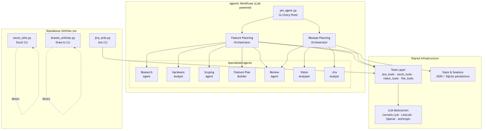
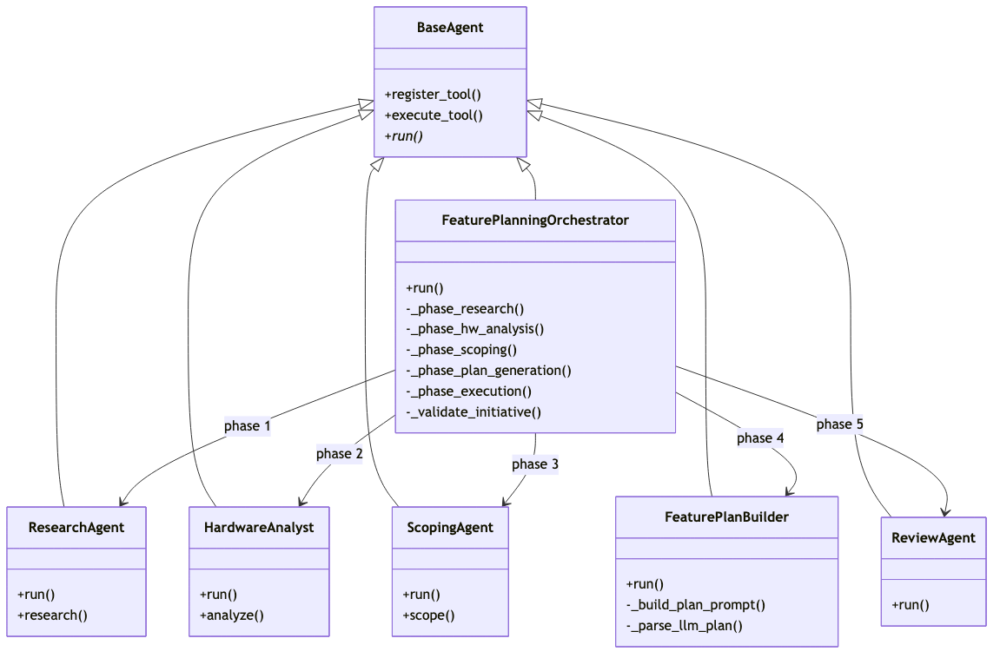

# Cornelis Project Management Agent and Utilities

AI-powered project management agents and standalone CLI utilities for Jira, Excel, and Draw.io at Cornelis Networks.

> **Primary use case:** An engineering team writes a scope document describing a feature.
> The PM agent reads that document and produces a complete Jira project plan —
> Initiative → Epics → Stories — ready for review and one-command execution.

## Table of Contents

- [Overview](#overview)
  - [How It Works — Scope Document to Jira Plan](#how-it-works--scope-document-to-jira-plan)
- [Architecture](#architecture)
- [Installation](#installation)
  - [Quick Start](#quick-start)
  - [Global CLI Install (pipx)](#global-cli-install-pipx)
- [Configuration](#configuration)
- [Agentic Workflows](#agentic-workflows)
  - [Feature Plan Workflow](#feature-plan-workflow)
  - [Bug Report Workflow](#bug-report-workflow)
  - [Release Planning Workflow](#release-planning-workflow)
- [Standalone Utilities](#standalone-utilities)
  - [Jira CLI (`jira_utils.py`)](#jira-cli-jira_utilspy)
  - [Excel CLI (`excel_utils.py`)](#excel-cli-excel_utilspy)
  - [Draw.io CLI (`drawio_utilities.py`)](#drawio-cli-drawio_utilitiespy)
  - [Excel Map Builder (`--build-excel-map`)](#excel-map-builder---build-excel-map)
- [Ticket Creation](#ticket-creation)
- [Agent Architecture](#agent-architecture)
- [Tools Reference](#tools-reference)
- [Development](#development)
- [License](#license)

---

## Overview

This repository contains two categories of tooling:

| Category | What it does | LLM required? |
|----------|-------------|----------------|
| **Agentic Workflows** | Multi-phase AI pipelines that research, scope, plan, and execute Jira project plans | Yes |
| **Standalone Utilities** | CLI tools for Jira queries, Excel formatting, Draw.io diagrams, and bulk operations | No |

### How It Works — Scope Document to Jira Plan

The flagship workflow takes a **scope document** authored by the engineering team and transforms it into a fully structured Jira project plan:

```
┌─────────────────┐      ┌──────────────┐      ┌──────────────┐      ┌──────────────┐
│  Scope Document  │ ──▶  │  PM Agent     │ ──▶  │  plan.json   │ ──▶  │  Jira        │
│  (MD/JSON/PDF)   │      │  (LLM-driven) │      │  plan.md     │      │  Tickets     │
└─────────────────┘      └──────────────┘      └──────────────┘      └──────────────┘
     Engineering              AI Agents            Review Output         --execute
     authors this             parse, scope,        Human reviews         creates
                              and plan             before executing      Initiative →
                                                                        Epics → Stories
```

**Three commands cover the entire lifecycle:**

```bash
# 1. Generate the plan from a scope document (dry-run — no tickets created)
pm_agent --workflow feature-plan --project STL --feature "SPDM Attestation" \
         --scope-doc scope.json

# 2. Review the generated plan
cat plans/STL-spdm-attestation/plan.md

# 3. Execute — create tickets in Jira (Initiative auto-created, Epics linked)
pm_agent --workflow feature-plan --project STL \
         --plan-file plans/STL-spdm-attestation/plan.json --execute

# Or attach to an existing Initiative instead of auto-creating one
pm_agent --workflow feature-plan --project STL \
         --plan-file plans/STL-spdm-attestation/plan.json \
         --initiative STL-74071 --execute
```

The scope document can be **JSON** (structured items with complexity/confidence), **Markdown**, **PDF**, or **DOCX**. The agent parses it, groups items into vertical-slice Epics, generates Stories with acceptance criteria, and outputs both `plan.json` (machine-readable) and `plan.md` (human-readable).

> **Initiative handling:** On `--execute`, Epics are always attached to an Initiative.
> If `--initiative KEY` is supplied, that ticket is validated and used.
> If omitted, a new Initiative is auto-created from the plan's feature name.

### Key Features

- **Scope-to-Jira pipeline** — Engineering writes a scope doc; the agent produces Initiative → Epics → Stories
- **Multiple entry points** — Start from a feature description, scope document, or previously generated plan
- **Multi-agent architecture** — Specialized agents for research, hardware analysis, scoping, plan building, and review
- **Human-in-the-loop** — Dry-run by default; `--execute` only after review
- **Automatic Initiative** — Epics are always parented to an Initiative; supply `--initiative KEY` or one is auto-created
- **Custom LLM support** — Works with Cornelis internal LLM or external providers (OpenAI, Anthropic)
- **Session persistence** — Resume interrupted workflows
- **Vision capabilities** — Extract data from images, slides, and PDFs
- **Standalone CLI tools** — Jira, Excel, and Draw.io utilities work without any LLM

---

## Architecture

### System Overview



> Source: [`docs/diagrams/system-overview.mmd`](docs/diagrams/system-overview.mmd) — regenerate with `mmdc -i docs/diagrams/system-overview.mmd -o docs/diagrams/system-overview.png -b transparent -w 1200`

### Feature Plan Workflow


> Source: [`docs/diagrams/feature-plan-workflow.mmd`](docs/diagrams/feature-plan-workflow.mmd)

### Bug Report Workflow


> Source: [`docs/diagrams/bug-report-workflow.mmd`](docs/diagrams/bug-report-workflow.mmd)

---

## Installation

### Quick Start

```bash
# 1. Clone the repository
git clone <repository-url>
cd jira-utilities

# 2. Create virtual environment
python3 -m venv venv
source venv/bin/activate

# 3. Install dependencies
pip install -r requirements.txt

# 4. Configure environment
cp .env.example .env
# Edit .env with your credentials
```

### Prerequisites

- Python 3.9 or higher
- Access to Cornelis Networks Jira instance
- Jira API token
- Access to Cornelis internal LLM (or external LLM API key) — *only for agentic workflows*

### Global CLI Install (pipx)

To make `jira-utils`, `drawio-utils`, and `excel-utils` available as commands in **any** directory (without activating a venv), use [pipx](https://pipx.pypa.io/):

```bash
# Install pipx (macOS)
brew install pipx
pipx ensurepath          # adds ~/.local/bin to PATH (restart terminal)

# Editable install from the repo — changes to source are reflected immediately
pipx install /path/to/this/repo --editable

# Verify
jira-utils -h
drawio-utils -h
excel-utils -h
```

This creates an isolated virtualenv with only the CLI dependencies (`jira`, `python-dotenv`, `requests`). The agent pipeline extras (`openai`, `litellm`, etc.) are **not** installed by default; add them with:

```bash
pipx install /path/to/this/repo --editable --pip-args='.[agents]'
```

To uninstall:

```bash
pipx uninstall cornelis-jira-tools
```

> **Note:** The `--editable` flag means the installed commands point back to your working copy. Any edits to `jira_utils.py` or `drawio_utilities.py` take effect immediately — no reinstall needed.

---

## Configuration

### Environment Variables

Copy `.env.example` to `.env` and configure:

```bash
# Jira credentials
JIRA_EMAIL=your.email@cornelisnetworks.com
JIRA_API_TOKEN=your_api_token
JIRA_URL=https://cornelisnetworks.atlassian.net

# Cornelis internal LLM
CORNELIS_LLM_BASE_URL=http://internal-llm.cornelis.com/v1
CORNELIS_LLM_API_KEY=your_internal_key
CORNELIS_LLM_MODEL=cornelis-default

# External LLM (fallback/vision)
OPENAI_API_KEY=your_openai_key
ANTHROPIC_API_KEY=your_anthropic_key

# Provider selection
DEFAULT_LLM_PROVIDER=cornelis
VISION_LLM_PROVIDER=cornelis
FALLBACK_ENABLED=true
```

### Multiple Environment Files

You can maintain separate `.env` files for different Jira instances (e.g., sandbox vs. production) and select one at runtime with `--env`:

```bash
# Default: loads .env
python3 jira_utils.py --list

# Load a specific env file
python3 jira_utils.py --list --env .env_prod
python3 jira_utils.py --list --env .env_sandbox

# Works with pm_agent.py too
python3 pm_agent.py --env .env_sandbox --workflow feature-plan --project STLSB --feature "Redfish RDE"
```

### LLM Provider Options

| Provider | Use Case | Configuration |
|----------|----------|---------------|
| `cornelis` | Default, internal LLM | `CORNELIS_LLM_*` variables |
| `openai` | GPT-4, GPT-4o | `OPENAI_API_KEY` |
| `anthropic` | Claude models | `ANTHROPIC_API_KEY` |

---

## Agentic Workflows

Agentic workflows are multi-phase AI pipelines orchestrated by [`pm_agent.py`](pm_agent.py). They require an LLM and use specialized agents to research, analyze, scope, and plan.

### Feature Plan Workflow

Generate a complete Jira project plan (Initiative → Epics → Stories) from a feature description, scope document, or previously generated plan. The **recommended path** is for the engineering team to author a scope document (JSON, Markdown, PDF, or DOCX) and feed it directly to the agent via `--scope-doc`, which skips the research and hardware-analysis phases and jumps straight to plan generation.

#### Entry Points

| Entry Point | Phases Executed | Use When |
|-------------|----------------|----------|
| `--scope-doc FILE` | Phases 4–6 (plan → review → execute) | **Recommended** — engineering team provides a scope document |
| `--feature "text"` or `--feature-prompt FILE` | All 6 phases | Starting from scratch — agent does its own research |
| `--plan-file FILE` | Phase 6 only (execute) | You already have a reviewed `plan.json` |

#### Examples

```bash
# ── Recommended: scope document → Jira plan ──────────────────────────

# 1. Generate plan from engineering scope document (dry-run)
pm_agent --workflow feature-plan --project STL --feature "SPDM Attestation" \
         --scope-doc scope.json

# 2. Review the generated plan
cat plans/STL-spdm-attestation/plan.md

# 3. Execute: create tickets in Jira under an Initiative
pm_agent --workflow feature-plan --project STL \
         --plan-file plans/STL-spdm-attestation/plan.json \
         --initiative STL-74071 --execute

# ── Alternative: full agentic workflow (no scope doc) ────────────────

# From a one-line feature description (all 6 phases)
pm_agent --workflow feature-plan --project STLSB --feature "Add PQC SPDM attestation"

# From a rich feature prompt file with supporting specs
pm_agent --workflow feature-plan --project STLSB --feature-prompt SPDM_1.2_Attestation.md \
         --docs spec.pdf datasheet.pdf

# ── Re-execute a previously generated plan ───────────────────────────

# Dry-run (shows summary only)
pm_agent --workflow feature-plan --project STLSB --plan-file plans/STLSB-spdm/plan.json

# Execute without an Initiative (Epics created unattached)
pm_agent --workflow feature-plan --project STLSB --plan-file plans/STLSB-spdm/plan.json --execute

# ── Sandbox testing ──────────────────────────────────────────────────

pm_agent --env .env_sandbox --workflow feature-plan --project STLSB \
         --feature "Redfish RDE" --scope-doc scope.md
```

#### Feature Plan Flags

| Flag | Description |
|------|-------------|
| `--feature TEXT` | Feature description string |
| `--feature-prompt FILE` | Rich feature prompt file (Markdown) — takes precedence over `--feature` |
| `--scope-doc FILE` | Pre-existing scope document (JSON/MD/PDF/DOCX) — skips research/HW/scoping phases |
| `--plan-file FILE` | Previously generated `plan.json` — skips all agentic phases |
| `--initiative KEY` | Optional existing Initiative ticket key (e.g. `STL-74071`). If supplied, validated and used as parent for all Epics. If omitted, a new Initiative is auto-created from the plan's feature name. |
| `--execute` | Actually create Jira tickets (default: dry-run) |
| `--docs FILE [FILE ...]` | Spec documents / datasheets for the research phase |
| `--output-dir DIR` | Root directory for output (default: `plans/<PROJECT>-<slug>/`) |

#### Output Files

All output lands in `plans/<PROJECT>-<slug>/`:

| File | Description |
|------|-------------|
| `plan.json` | Machine-readable Jira plan (Epics + Stories) |
| `plan.md` | Human-readable Markdown plan |
| `scope.json` | Scoping agent output |
| `research.json` | Research agent output |
| `hw_profile.json` | Hardware analyst output |
| `debug/*.md` | Raw LLM responses (for debugging) |

---

### Bug Report Workflow

Generate a cleaned, enriched bug report from a Jira filter.

```bash
# Basic usage — looks up filter by name, pulls tickets, sends to LLM, converts to Excel
pm_agent --workflow bug-report --filter "SW 12.1.1 P0/P1 Bugs" --timeout 800

# With verbose logging
pm_agent --workflow bug-report --filter "SW 12.1.1 P0/P1 Bugs" --timeout 800 --verbose

# Override the LLM model for this run (useful from Jenkins Choice Parameter)
pm_agent --workflow bug-report --filter "SW 12.1.1 P0/P1 Bugs" --model developer-opus --timeout 800

# Custom prompt file
pm_agent --workflow bug-report --filter "My Filter" --prompt my_prompt.md --timeout 600

# With dashboard pivot columns
pm_agent --workflow bug-report --filter "SW 12.1.1 P0/P1 Bugs" --d-columns Phase Customer Product Module Priority
```

**Steps performed:**

| Step | Action | Output |
|------|--------|--------|
| 1 | Connect to Jira | — |
| 2 | Look up filter by name from favourite filters | Filter ID |
| 3 | Run filter to get tickets with latest comments | Issues list |
| 4 | Dump tickets to JSON | `<filter_name>.json` |
| 5 | Send JSON + prompt to LLM for analysis | `llm_output.md` + extracted files |
| 6 | Convert any extracted CSV to styled Excel | `<name>.xlsx` |

#### Bug Report Flags

| Flag | Description |
|------|-------------|
| `--filter NAME` | Jira filter name to look up (required) |
| `--prompt FILE` | LLM prompt file (default: `config/prompts/cn5000_bugs_clean.md`) |
| `--d-columns COL [COL ...]` | Column names for the Excel Dashboard pivot sheet |
| `--output FILE` | Override output filename |

---

### Release Planning Workflow

Full release planning from roadmap documents.

```bash
# Run full release planning workflow
pm_agent --plan --project PROJ --roadmap slides.pptx --org-chart org.drawio

# Analyze Jira project state
pm_agent --analyze --project PROJ --quick

# Analyze roadmap files
pm_agent --vision roadmap.png roadmap.xlsx

# List / resume saved sessions
pm_agent --sessions --list-sessions
pm_agent --resume abc123
```

---

### Global Workflow Flags

These flags apply to all agentic workflows:

| Flag | Description |
|------|-------------|
| `--workflow NAME` | Workflow to run (`bug-report`, `feature-plan`) |
| `--project KEY` | Jira project key |
| `--model MODEL`, `-m` | LLM model name override (e.g. `developer-opus`, `gpt-4o`) |
| `--timeout SECS` | LLM request timeout in seconds |
| `--env FILE` | Load a specific `.env` file |
| `-v`, `--verbose` | Enable verbose (DEBUG-level) logging |
| `-q`, `--quiet` | Minimal stdout output |

---

## Standalone Utilities

These CLI tools work **without any LLM** and can be installed globally via `pipx`.

| Command | Source | Description |
|---------|--------|-------------|
| `jira-utils` | [`jira_utils.py`](jira_utils.py) | Full-featured Jira CLI (project queries, ticket creation, bulk ops, dashboards) |
| `excel-utils` | [`excel_utils.py`](excel_utils.py) | Excel workbook concatenation, CSV conversion, and diff reporting |
| `drawio-utils` | [`drawio_utilities.py`](drawio_utilities.py) | Draw.io diagram generator from Jira hierarchy CSV exports |

Run any of them with `-h` for full help:

```bash
jira-utils -h
excel-utils -h
drawio-utils -h
```

---

### Jira CLI (`jira_utils.py`)

The standalone Jira CLI provides project inspection, ticket queries, ticket creation, bulk operations, and dashboard management.

#### Project & Metadata

```bash
# List all accessible projects
python3 jira_utils.py --list

# Project metadata
python3 jira_utils.py --project PROJ --get-workflow
python3 jira_utils.py --project PROJ --get-issue-types
python3 jira_utils.py --project PROJ --get-fields
python3 jira_utils.py --project PROJ --get-versions
python3 jira_utils.py --project PROJ --get-components
```

#### Ticket Queries

```bash
# Get tickets with filters
python3 jira_utils.py --project PROJ --get-tickets
python3 jira_utils.py --project PROJ --get-tickets --issue-types Bug Story --status Open --limit 50

# Release tickets
python3 jira_utils.py --project PROJ --releases "12.*"
python3 jira_utils.py --project PROJ --release-tickets "12.3*" --issue-types Bug Story Task

# Tickets with no release
python3 jira_utils.py --project PROJ --no-release --issue-types Bug --status Open

# Ticket totals
python3 jira_utils.py --project PROJ --total --issue-types Bug --status Open "In Progress"

# Custom JQL
python3 jira_utils.py --jql "project = PROJ AND status = Open" --limit 20

# Hierarchy & relationships
python3 jira_utils.py --get-children PROJ-100
python3 jira_utils.py --get-related PROJ-100 --hierarchy
python3 jira_utils.py --get-related PROJ-100 --hierarchy 2   # depth-limited
```

#### Date Filters

All ticket queries accept `--date`:

| Value | Meaning |
|-------|---------|
| `today` | Created today |
| `week` | Last 7 days |
| `month` | Last 30 days |
| `year` | Last 365 days |
| `all` | No date filter |
| `MM-DD-YYYY:MM-DD-YYYY` | Custom date range |

```bash
python3 jira_utils.py --project PROJ --get-tickets --date month
python3 jira_utils.py --project PROJ --get-tickets --date 01-01-2025:06-30-2025
```

#### Dump to File

Any query can be dumped to CSV or JSON:

```bash
python3 jira_utils.py --project PROJ --get-tickets --dump-file tickets
python3 jira_utils.py --project PROJ --get-tickets --dump-file tickets --dump-format json
python3 jira_utils.py --jql "project = PROJ" --dump-file results --dump-format csv
```

#### Filters

```bash
# List your favourite filters
python3 jira_utils.py --list-filters
python3 jira_utils.py --list-filters --owner user@email.com

# Run a filter by ID
python3 jira_utils.py --run-filter 12345 --limit 100
python3 jira_utils.py --run-filter 12345 --dump-file results
```

#### Bulk Update

```bash
# Step 1: Find tickets and dump to CSV
python3 jira_utils.py --jql "project = PROJ AND fixVersion is EMPTY" --dump-file orphans

# Step 2: Preview (dry-run is default)
python3 jira_utils.py --bulk-update --input-file orphans.csv --set-release "12.3.0"

# Step 3: Execute
python3 jira_utils.py --bulk-update --input-file orphans.csv --set-release "12.3.0" --execute

# Other bulk operations
python3 jira_utils.py --bulk-update --input-file tickets.csv --transition "Closed" --execute
python3 jira_utils.py --bulk-update --input-file tickets.csv --assign "user@email.com" --execute
python3 jira_utils.py --bulk-update --input-file tickets.csv --remove-release --execute
```

#### Bulk Delete

```bash
# Preview deletes (dry-run)
python3 jira_utils.py --bulk-delete --input-file to_delete.csv

# Execute deletes (requires interactive confirmation)
python3 jira_utils.py --bulk-delete --input-file to_delete.csv --execute

# Delete parents and their subtasks
python3 jira_utils.py --bulk-delete --input-file parents.csv --delete-subtasks --execute

# Skip confirmation (DANGEROUS)
python3 jira_utils.py --bulk-delete --input-file to_delete.csv --execute --force
```

#### Dashboard Management

```bash
# List dashboards
python3 jira_utils.py --dashboards
python3 jira_utils.py --dashboards --owner user@email.com
python3 jira_utils.py --dashboards --shared

# Get dashboard details & gadgets
python3 jira_utils.py --dashboard 12345
python3 jira_utils.py --gadgets 12345

# Create / copy / update / delete
python3 jira_utils.py --create-dashboard "My Dashboard" --description "desc"
python3 jira_utils.py --copy-dashboard 12345 --name "Copy of Dashboard"
python3 jira_utils.py --update-dashboard 12345 --name "New Name"
python3 jira_utils.py --delete-dashboard 12345 --force

# Gadget management
python3 jira_utils.py --add-gadget com.atlassian.jira.gadgets:filter-results-gadget --dashboard 12345
python3 jira_utils.py --remove-gadget 67890 --dashboard 12345
python3 jira_utils.py --update-gadget 67890 --dashboard 12345 --position 0,1 --color blue
```

---

### Excel CLI (`excel_utils.py`)

Concatenate, convert, and diff Excel (`.xlsx`) workbooks from the command line.

#### Concatenation

```bash
# Merge all rows from multiple files into a single sheet (columns are unioned)
python3 excel_utils.py --concat fileA.xlsx fileB.xlsx --method merge-sheet --output merged.xlsx

# Add each file as a separate sheet in the output workbook
python3 excel_utils.py --concat fileA.xlsx fileB.xlsx --method add-sheet --output combined.xlsx

# Merge all .xlsx files in the current directory
python3 excel_utils.py --concat *.xlsx --method merge-sheet --output all_data.xlsx
```

#### Conversion

```bash
# Excel → CSV
python3 excel_utils.py --convert-to-csv data.xlsx
python3 excel_utils.py --convert-to-csv data.xlsx --output custom_name.csv

# CSV → Excel (with header styling, conditional formatting, auto-fit columns)
python3 excel_utils.py --convert-from-csv data.csv
python3 excel_utils.py --convert-from-csv data.csv --output styled.xlsx

# CSV → Excel with clickable Jira ticket links in the "key" column
python3 excel_utils.py --convert-from-csv data.csv --jira-url https://cornelisnetworks.atlassian.net
```

#### Diff

```bash
# Diff two files — produces a report with Summary and Diff sheets
python3 excel_utils.py --diff fileA.xlsx fileB.xlsx --output changes.xlsx

# Pairwise diff across three files (A→B, B→C)
python3 excel_utils.py --diff v1.xlsx v2.xlsx v3.xlsx
```

Rows are matched by a key column (`key` if present, otherwise the first column). Each row is marked **ADDED**, **REMOVED**, **CHANGED**, or **SAME**.

#### Formatting Options

All output workbooks include automatic styling by default:

| Feature | Description |
|---------|-------------|
| Header styling | Bold white text on dark-blue background, centered, with borders |
| Status conditional formatting | Cell fill color based on status value (e.g., green for Closed, red for Open) |
| Priority conditional formatting | Red fill for P0-Stopper, yellow fill for P1-Critical |
| Jira ticket hyperlinks | "key" columns become clickable links to the Jira ticket (when `--jira-url` or `JIRA_URL` is set) |
| Auto-fit columns | Column widths adjusted to content |
| Frozen header row | First row stays visible when scrolling |
| Auto-filter | Drop-down filters on every column |

Use `--no-formatting` to disable all styling and produce a plain data-only workbook:

```bash
python3 excel_utils.py --convert-from-csv data.csv --no-formatting
python3 excel_utils.py --concat *.xlsx --no-formatting
```

#### Excel CLI Flags

| Flag | Description |
|------|-------------|
| `--concat FILE [FILE ...]` | Two or more `.xlsx` files to concatenate |
| `--method merge-sheet\|add-sheet` | `merge-sheet` (default) merges all rows into one sheet; `add-sheet` creates a sheet per file |
| `--convert-to-csv FILE` | Convert `.xlsx` to comma-delimited `.csv` |
| `--convert-from-csv FILE` | Convert `.csv` to styled `.xlsx` |
| `--diff FILE [FILE ...]` | Two or more `.xlsx` files to diff |
| `--jira-url URL` | Jira instance URL — makes "key" columns clickable hyperlinks |
| `--no-formatting` | Disable all Excel formatting |
| `--output FILE` | Override the default output filename |

---

### Draw.io CLI (`drawio_utilities.py`)

Generate draw.io dependency diagrams from Jira hierarchy CSV exports.

```bash
# Basic usage
python3 drawio_utilities.py --create-map tickets.csv

# Custom output file and title
python3 drawio_utilities.py --create-map tickets.csv --output diagram.drawio --title "Release 12.2 Dependencies"
```

#### End-to-End Workflow

```bash
# 1. Export hierarchy from Jira
python3 jira_utils.py --get-related PROJ-100 --hierarchy --dump-file tickets

# 2. Generate draw.io diagram
python3 drawio_utilities.py --create-map tickets.csv

# 3. Open the .drawio file in draw.io or VS Code
```

#### Color Coding

| Link Type | Border | Fill |
|-----------|--------|------|
| Root ticket | — | Light green |
| `is blocked by` / `blocks` | Red | Light red |
| `relates to` | Blue | Light blue |
| Other | Gray | White |

---

### Excel Map Builder (`--build-excel-map`)

Build a multi-sheet Excel workbook from one or more Jira root tickets, traversing the hierarchy and related issues.

```bash
# Single root ticket
pm_agent --build-excel-map STL-74071

# Multiple root tickets with depth control
pm_agent --build-excel-map STL-74071 STL-76297 --hierarchy 2 --output my_map.xlsx
```

---

## Ticket Creation

Create Jira tickets from the CLI using `--create-ticket`. All creates are **dry-run by default**; add `--execute` to actually create the ticket.

There are two modes:

| Mode | Command | Description |
|------|---------|-------------|
| **CLI flags** | `--create-ticket` | Supply all fields via CLI arguments |
| **JSON file** | `--create-ticket path/to/file.json` | Load fields from a JSON file |

When both a JSON file and CLI flags are provided, **CLI flags override** the JSON values.

#### Required Fields

| Field | CLI Flag | JSON Key |
|-------|----------|----------|
| Project | `--project KEY` | `project` |
| Summary | `--summary TEXT` | `summary` |
| Issue type | `--issue-type TYPE` | `issue_type` |

#### Optional Fields

| Field | CLI Flag | JSON Key |
|-------|----------|----------|
| Description | `--ticket-description TEXT` | `description` |
| Assignee | `--assignee-id ACCOUNT_ID` | `assignee_id` |
| Components | `--components NAME [NAME ...]` | `components` |
| Fix versions | `--fix-versions VERSION [VERSION ...]` | `fix_versions` |
| Labels | `--labels LABEL [LABEL ...]` | `labels` |
| Parent | `--parent KEY` | `parent` |

#### Examples

```bash
# Dry-run (preview only)
python3 jira_utils.py --create-ticket \
  --project PROJ --summary "Fix login timeout" --issue-type Bug

# Execute (actually create the ticket)
python3 jira_utils.py --create-ticket \
  --project PROJ --summary "Fix login timeout" --issue-type Bug \
  --components Platform --labels triage --fix-versions 12.3.0 \
  --execute

# From JSON file
python3 jira_utils.py --create-ticket data/templates/create_story.json --execute

# JSON file + CLI override
python3 jira_utils.py --create-ticket data/templates/create_story.json \
  --summary "Override summary from CLI" --execute
```

#### JSON Input Format

See [`data/templates/create_ticket_input.schema.json`](data/templates/create_ticket_input.schema.json) for the full JSON Schema.

#### Template Files

| File | Purpose |
|------|---------|
| [`data/templates/create_ticket_input.schema.json`](data/templates/create_ticket_input.schema.json) | JSON Schema (draft 2020-12) for the `--create-ticket FILE` input format |
| [`data/templates/create_ticket_input.example.json`](data/templates/create_ticket_input.example.json) | Generic Task example |
| [`data/templates/create_story.json`](data/templates/create_story.json) | Story template with acceptance criteria |

---

## Agent Architecture

### Agent Hierarchy



> Source: [`docs/diagrams/agent-hierarchy.mmd`](docs/diagrams/agent-hierarchy.mmd)

### Agents

| Agent | Role |
|-------|------|
| **Feature Planning Orchestrator** | Coordinates the end-to-end feature-to-Jira workflow across all phases |
| **Research Agent** | Researches the feature domain using web search and internal knowledge |
| **Hardware Analyst** | Maps hardware architecture, interfaces, and existing SW/FW stack |
| **Scoping Agent** | Breaks the feature into concrete SW/FW work items with complexity estimates |
| **Feature Plan Builder** | Converts scope items into Jira Epics and Stories following the Story=Branch rule |
| **Review Agent** | Presents the plan for human review and handles modifications |
| **Vision Analyzer** | Extracts roadmap data from images, PowerPoint, and Excel |
| **Jira Analyst** | Analyzes current Jira project state (releases, components, assignments) |

### Programmatic Usage

```python
from agents.feature_planning_orchestrator import FeaturePlanningOrchestrator

orchestrator = FeaturePlanningOrchestrator(output_dir='plans/my-feature')

response = orchestrator.run({
    'project_key': 'STLSB',
    'feature_request': 'Add PQC SPDM attestation support',
    'mode': 'full',           # or 'scope-to-plan', 'execute-plan'
    'execute': False,          # dry-run
    'initiative_key': '',      # optional: attach Epics to Initiative
})

if response.success:
    print(response.content)
    plan = response.metadata.get('state', {}).get('jira_plan')
```

---

## Tools Reference

### Jira Tools

| Tool | Description |
|------|-------------|
| `get_project_info` | Get project details |
| `get_project_workflows` | Get workflow statuses |
| `get_project_issue_types` | Get issue types |
| `get_releases` | List releases/versions |
| `get_release_tickets` | Get tickets for a release |
| `get_components` | List project components |
| `get_related_tickets` | Traverse ticket links/hierarchy |
| `search_tickets` | Run JQL query |
| `create_ticket` | Create new ticket |
| `update_ticket` | Update existing ticket |
| `create_release` | Create new release |
| `link_tickets` | Create ticket links |
| `assign_ticket` | Assign ticket to user |
| `bulk_update_tickets` | Bulk update from CSV |

### Draw.io Tools

| Tool | Description |
|------|-------------|
| `parse_org_chart` | Extract org structure from draw.io |
| `get_responsibilities` | Map people to responsibility areas |
| `create_ticket_diagram` | Generate diagram from CSV |
| `create_diagram_from_tickets` | Generate diagram from ticket data |

### Vision Tools

| Tool | Description |
|------|-------------|
| `analyze_image` | Analyze image with vision LLM |
| `extract_roadmap_from_ppt` | Extract from PowerPoint |
| `extract_roadmap_from_excel` | Extract from Excel |

### Excel Tools

| Tool | Description |
|------|-------------|
| `convert_from_csv` | CSV → styled Excel with formatting |
| `convert_to_csv` | Excel → CSV |
| `concat_merge_sheet` | Merge multiple workbooks into one sheet |
| `concat_add_sheet` | Combine workbooks as separate sheets |
| `diff_files` | Diff two or more workbooks |

---

## Development

### Project Structure

```
jira-utilities/
├── pm_agent.py                  # Agentic workflow entry point
├── jira_utils.py                # Standalone Jira CLI (→ jira-utils)
├── excel_utils.py               # Standalone Excel CLI (→ excel-utils)
├── drawio_utilities.py          # Standalone Draw.io CLI (→ drawio-utils)
├── agents/                      # Agent definitions
│   ├── base.py                  # BaseAgent abstract class
│   ├── feature_planning_orchestrator.py
│   ├── feature_plan_builder.py
│   ├── feature_planning_models.py
│   ├── research_agent.py
│   ├── hardware_analyst.py
│   ├── scoping_agent.py
│   ├── review_agent.py
│   ├── orchestrator.py          # Release planning orchestrator
│   ├── jira_analyst.py
│   ├── planning_agent.py
│   └── vision_analyzer.py
├── tools/                       # Agent tools
│   ├── base.py                  # @tool decorator & ToolResult
│   ├── jira_tools.py
│   ├── excel_tools.py
│   ├── drawio_tools.py
│   ├── vision_tools.py
│   ├── file_tools.py
│   ├── plan_export_tools.py
│   ├── web_search_tools.py
│   ├── knowledge_tools.py
│   └── mcp_tools.py
├── llm/                         # LLM abstraction
│   ├── base.py                  # Abstract interface
│   ├── cornelis_llm.py          # Internal LLM client
│   ├── litellm_client.py        # External LLM client
│   └── config.py                # LLM configuration
├── state/                       # State management
│   ├── session.py               # Session state
│   └── persistence.py           # Storage backends
├── config/                      # Configuration
│   ├── settings.py              # App settings
│   └── prompts/                 # Agent system prompts
│       ├── feature_planning_orchestrator.md
│       ├── feature_plan_builder.md
│       ├── scoping_agent.md
│       ├── hardware_analyst.md
│       ├── research_agent.md
│       ├── review_agent.md
│       └── ...
├── data/
│   ├── templates/               # Ticket creation templates & schema
│   └── knowledge/               # Product knowledge base
├── plans/                       # Generated plans & architecture docs
├── pyproject.toml               # Package metadata & console_scripts
├── requirements.txt             # Dependencies
├── .env.example                 # Environment template
└── .gitignore
```

### Adding New Tools

1. Create tool function with `@tool` decorator:
   ```python
   from tools.base import tool, ToolResult

   @tool(description='My new tool')
   def my_tool(param: str) -> ToolResult:
       # Implementation
       return ToolResult.success({'result': 'data'})
   ```

2. Add to tool collection class
3. Register with agent

### Adding New Agents

1. Create agent class extending `BaseAgent`
2. Define instruction prompt in `config/prompts/`
3. Register tools
4. Implement `run()` method

### Testing

```bash
# Run tests
pytest tests/

# Run specific test
pytest tests/test_tools/test_jira_tools.py
```

---

## License

Proprietary — Cornelis Networks

## Support

For issues or questions, contact the Engineering Tools team.
