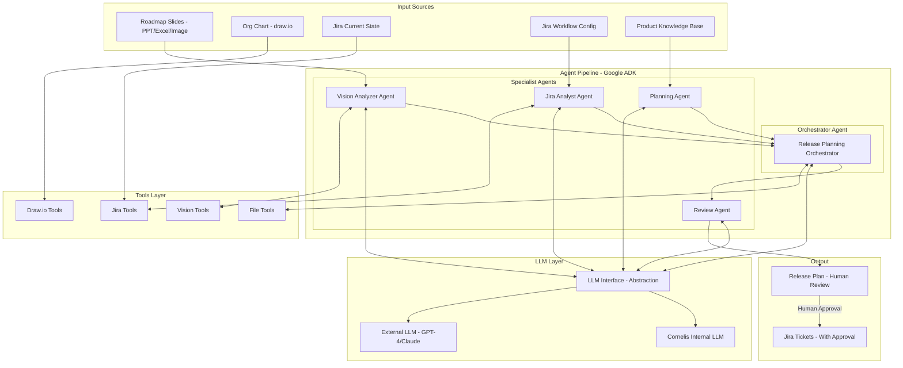
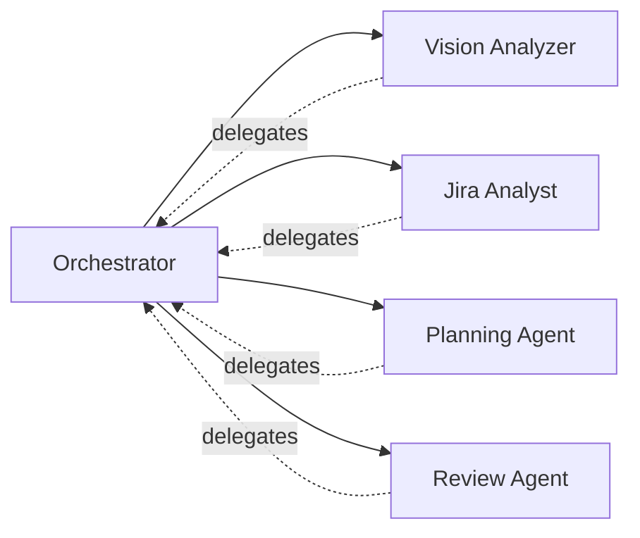
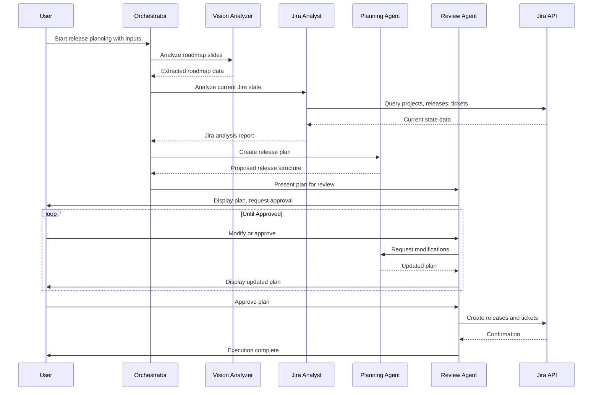

# Cornelis Agent Pipeline Architecture

## Overview

This document describes the architecture for a Google ADK-based agent pipeline that automates Jira release planning based on roadmap slides, org charts, and Cornelis product knowledge.

## Architecture Diagram



## Directory Structure

```
cornelis-agent/
├── .env.example                 # Environment variable template
├── .env                         # Local environment variables - gitignored
├── .gitignore
├── requirements.txt             # Python dependencies
├── README.md                    # Project documentation
│
├── llm/                         # LLM abstraction layer
│   ├── __init__.py
│   ├── base.py                  # Abstract LLM interface
│   ├── cornelis_llm.py          # Cornelis internal LLM client
│   ├── litellm_client.py        # LiteLLM wrapper for external models
│   └── config.py                # LLM configuration and model selection
│
├── tools/                       # Agent tools
│   ├── __init__.py
│   ├── base.py                  # Base tool class
│   ├── jira_tools.py            # Jira operations - wraps jira_utils.py
│   ├── drawio_tools.py          # Draw.io operations - wraps drawio_utilities.py
│   ├── vision_tools.py          # Image/document analysis
│   ├── file_tools.py            # File I/O operations
│   └── knowledge_tools.py       # Cornelis product knowledge retrieval
│
├── agents/                      # Agent definitions
│   ├── __init__.py
│   ├── orchestrator.py          # Main orchestrator agent
│   ├── vision_analyzer.py       # Roadmap slide analysis agent
│   ├── jira_analyst.py          # Jira state analysis agent
│   ├── planning_agent.py        # Release structure planning agent
│   └── review_agent.py          # Human review facilitation agent
│
├── pipelines/                   # Pipeline definitions
│   ├── __init__.py
│   ├── release_planning.py      # Release planning pipeline
│   └── base.py                  # Base pipeline class
│
├── state/                       # State management
│   ├── __init__.py
│   ├── session.py               # Session state management
│   └── persistence.py           # State persistence - SQLite/JSON
│
├── config/                      # Configuration
│   ├── __init__.py
│   ├── settings.py              # Application settings
│   ├── jira_workflow.yaml       # Jira workflow definitions
│   └── prompts/                 # Agent prompts
│       ├── orchestrator.md
│       ├── vision_analyzer.md
│       ├── jira_analyst.md
│       ├── planning_agent.md
│       └── review_agent.md
│
├── data/                        # Data directory
│   ├── sessions/                # Persisted session state
│   ├── knowledge/               # Product knowledge base
│   └── templates/               # Jira ticket templates
│
├── legacy/                      # Existing utilities - moved here
│   ├── jira_utils.py            # Original Jira utilities
│   └── drawio_utilities.py      # Original draw.io utilities
│
├── pm_agent.py                      # CLI entry point
└── tests/                       # Test suite
    ├── __init__.py
    ├── test_llm/
    ├── test_tools/
    ├── test_agents/
    └── test_pipelines/
```

## Component Details

### 1. LLM Abstraction Layer - llm/

The LLM layer provides a unified interface for interacting with different LLM backends.

#### llm/base.py - Abstract Interface

```python
from abc import ABC, abstractmethod
from typing import List, Dict, Any, Optional
from dataclasses import dataclass

@dataclass
class Message:
    role: str  # system, user, assistant
    content: str | List[Dict]  # text or multimodal content

@dataclass
class LLMResponse:
    content: str
    model: str
    usage: Dict[str, int]
    raw_response: Any

class BaseLLM(ABC):
    @abstractmethod
    def chat(self, messages: List[Message], **kwargs) -> LLMResponse:
        '''Send chat completion request.'''
        pass
    
    @abstractmethod
    def chat_with_vision(self, messages: List[Message], images: List[str], **kwargs) -> LLMResponse:
        '''Send chat completion with image analysis.'''
        pass
    
    @abstractmethod
    def supports_vision(self) -> bool:
        '''Check if model supports vision/image analysis.'''
        pass
```

#### llm/cornelis_llm.py - Internal LLM Client

```python
# OpenAI-compatible client for Cornelis internal LLM
# Uses standard OpenAI SDK with custom base_url
```

#### llm/config.py - Model Configuration

```python
# Configuration for model selection
# - Default to Cornelis internal LLM
# - Fallback to external for vision if internal doesnt support
# - Allow override via environment or runtime config
```

### 2. Tools Layer - tools/

Tools wrap existing functionality and expose it to agents via Google ADK tool interface.

#### tools/jira_tools.py

Wraps [`jira_utils.py`](jira_utils.py:1) functionality as ADK tools:

| Tool | Description |
|------|-------------|
| `get_project_info` | Get project details, workflows, issue types |
| `get_releases` | List releases matching pattern |
| `get_release_tickets` | Get tickets for a release |
| `search_tickets` | Run JQL query |
| `create_ticket` | Create new Jira ticket |
| `update_ticket` | Update existing ticket |
| `create_release` | Create new release version |
| `link_tickets` | Create ticket links |
| `get_components` | Get project components |
| `assign_ticket` | Assign ticket to user |

#### tools/drawio_tools.py

Wraps [`drawio_utilities.py`](drawio_utilities.py:1) functionality:

| Tool | Description |
|------|-------------|
| `parse_org_chart` | Extract org structure from draw.io file |
| `get_responsibilities` | Map people to areas of responsibility |
| `create_ticket_diagram` | Generate draw.io diagram from ticket hierarchy |

#### tools/vision_tools.py

New tools for image/document analysis:

| Tool | Description |
|------|-------------|
| `analyze_image` | Analyze image content using vision LLM |
| `extract_roadmap_from_ppt` | Extract roadmap data from PowerPoint |
| `extract_roadmap_from_excel` | Extract roadmap data from Excel |
| `extract_text_from_image` | OCR and structured extraction |

### 3. Agents - agents/

Using Google ADK `LlmAgent` with LiteLLM for custom model support.

#### Agent Hierarchy



#### Orchestrator Agent - agents/orchestrator.py

**Role**: Coordinates the release planning workflow, delegates to specialist agents, manages state.

**Tools**: All tools available for delegation decisions

**Sub-agents**: Vision Analyzer, Jira Analyst, Planning Agent, Review Agent

#### Vision Analyzer Agent - agents/vision_analyzer.py

**Role**: Analyzes roadmap slides/images to extract:
- Release names and timelines
- Feature descriptions
- Dependencies
- Milestones

**Tools**: `analyze_image`, `extract_roadmap_from_ppt`, `extract_roadmap_from_excel`

#### Jira Analyst Agent - agents/jira_analyst.py

**Role**: Analyzes current Jira state:
- Existing releases and their tickets
- Component structure
- Team assignments
- Workflow states

**Tools**: `get_project_info`, `get_releases`, `search_tickets`, `get_components`

#### Planning Agent - agents/planning_agent.py

**Role**: Creates the release structure plan:
- Maps roadmap items to Jira structure
- Determines ticket hierarchy - Epic > Story > Task
- Assigns components and owners
- Sets release versions

**Tools**: Knowledge tools, planning templates

#### Review Agent - agents/review_agent.py

**Role**: Facilitates human review:
- Presents plan in readable format
- Handles modifications
- Manages approval workflow
- Executes approved changes

**Tools**: All Jira write tools - create_ticket, update_ticket, create_release

### 4. Pipeline - pipelines/release_planning.py

The release planning pipeline orchestrates the end-to-end workflow:



### 5. State Management - state/

#### Session State

```python
@dataclass
class SessionState:
    session_id: str
    created_at: datetime
    updated_at: datetime
    
    # Input data
    roadmap_data: Dict[str, Any]
    org_chart_data: Dict[str, Any]
    jira_state: Dict[str, Any]
    
    # Planning state
    proposed_releases: List[Dict]
    proposed_tickets: List[Dict]
    
    # Approval state
    approved_items: List[str]
    pending_items: List[str]
    rejected_items: List[str]
    
    # Execution state
    created_releases: List[str]
    created_tickets: List[str]
    errors: List[str]
```

#### Persistence Options

- **JSON files**: Simple, human-readable, good for debugging
- **SQLite**: Better for querying historical sessions
- **Both**: JSON for current session, SQLite for history

### 6. Configuration

#### .env.example

```bash
# Jira API Credentials
JIRA_EMAIL=your.email@cornelisnetworks.com
JIRA_API_TOKEN=your_api_token_here
JIRA_URL=https://cornelisnetworks.atlassian.net

# Cornelis Internal LLM
CORNELIS_LLM_BASE_URL=http://internal-llm.cornelis.com/v1
CORNELIS_LLM_API_KEY=your_internal_api_key
CORNELIS_LLM_MODEL=cornelis-default

# External LLM - Fallback/Vision
OPENAI_API_KEY=your_openai_key
ANTHROPIC_API_KEY=your_anthropic_key

# LLM Configuration
DEFAULT_LLM_PROVIDER=cornelis  # cornelis, openai, anthropic
VISION_LLM_PROVIDER=cornelis   # cornelis, openai, anthropic
FALLBACK_ENABLED=true

# Agent Configuration
AGENT_LOG_LEVEL=INFO
AGENT_MAX_ITERATIONS=50
AGENT_TIMEOUT_SECONDS=300

# State Persistence
STATE_PERSISTENCE_ENABLED=true
STATE_PERSISTENCE_PATH=./data/sessions
STATE_PERSISTENCE_FORMAT=json  # json, sqlite, both
```

## Human-in-the-Loop Workflow

The agent implements a careful approval workflow:

### 1. Plan Generation Phase - No Jira Writes

```
User provides inputs
    ↓
Agent analyzes and generates plan
    ↓
Plan presented to user
```

### 2. Review Phase - Interactive

```
User reviews each section:
    - Releases to create
    - Epic tickets
    - Story tickets
    - Assignments
    - Components
    ↓
User can:
    - Approve item
    - Modify item
    - Reject item
    - Request re-analysis
```

### 3. Execution Phase - With Confirmation

```
For each approved item:
    ↓
Show what will be created
    ↓
User confirms
    ↓
Execute in Jira
    ↓
Report result
```

## Google ADK Integration

### Why Google ADK Works for This

1. **Model Agnostic**: ADK supports custom models via LiteLLM, allowing use of Cornelis internal LLM
2. **Multi-Agent**: Built-in support for agent hierarchies and delegation
3. **Tool Integration**: Clean tool definition and execution model
4. **State Management**: Session and conversation state handling
5. **Python Native**: Matches existing codebase style

### ADK Agent Definition Example

```python
from google.adk.agents import LlmAgent
from google.adk.models.lite_llm import LiteLlm

# Configure Cornelis LLM via LiteLLM
cornelis_model = LiteLlm(
    model="openai/cornelis-default",  # LiteLLM model string format
    api_base=os.getenv("CORNELIS_LLM_BASE_URL"),
    api_key=os.getenv("CORNELIS_LLM_API_KEY")
)

# Define orchestrator agent
orchestrator = LlmAgent(
    model=cornelis_model,
    name="release_planning_orchestrator",
    instruction=load_prompt("orchestrator.md"),
    tools=[
        get_project_info,
        get_releases,
        search_tickets,
        # ... other tools
    ],
    sub_agents=[
        vision_analyzer,
        jira_analyst,
        planning_agent,
        review_agent
    ]
)
```

## Implementation Phases

### Phase 1: Foundation
- [ ] Set up project structure
- [ ] Implement LLM abstraction layer
- [ ] Move existing utilities to legacy/
- [ ] Create tool wrappers for jira_utils

### Phase 2: Core Agents
- [ ] Implement Jira Analyst agent
- [ ] Implement Planning agent
- [ ] Implement basic Orchestrator

### Phase 3: Vision & Input
- [ ] Implement Vision tools
- [ ] Implement Vision Analyzer agent
- [ ] Add draw.io parsing tools

### Phase 4: Review & Execution
- [ ] Implement Review agent
- [ ] Add human-in-the-loop workflow
- [ ] Implement state persistence

### Phase 5: Polish
- [ ] Add comprehensive logging
- [ ] Error handling and recovery
- [ ] Testing suite
- [ ] Documentation

## Open Questions

1. **Knowledge Base**: How should Cornelis product knowledge be stored and accessed? Options:
   - Markdown files in `data/knowledge/`
   - Vector database for semantic search
   - Structured YAML/JSON

2. **Ticket Templates**: Should we have predefined templates for common ticket types?

3. **Batch vs Interactive**: For large release plans, should we support batch approval of similar items?
