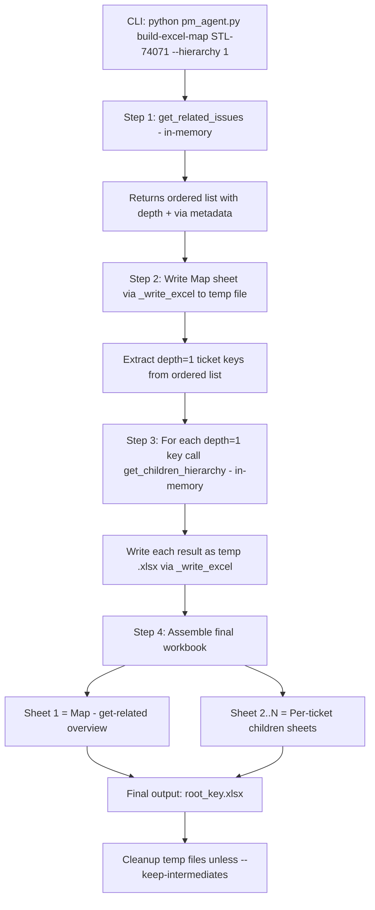

# `build-excel-map` Architecture

## Overview

A new subcommand in `pm_agent.py` that orchestrates a multi-step Jira data gathering and Excel assembly pipeline. It produces a single `.xlsx` workbook with:

- **Sheet 1 ("Map")**: The get-related overview showing Depth 0 / Depth 1 columns (the root ticket and its direct related issues)
- **Sheets 2..N (per ticket key)**: Each depth=1 ticket's full child hierarchy as a separate sheet

Designed as a deterministic pipeline in `pm_agent.py` (subcommand `build-excel-map`) that imports from `jira_utils.py` for Jira data gathering and `_write_excel()` for Excel output. Can later be wrapped as an agent tool in `tools/excel_tools.py`.

## Workflow Diagram



## Detailed Step Breakdown

### Step 1: Get Related Issues (in-memory)

- Calls the existing `get_related_issues()` function logic **but returns data instead of printing/dumping**.
- Uses `--hierarchy 1` (configurable) to get direct links + direct children of the root ticket.
- Returns the `ordered` list (list of dicts with `issue`, `depth`, `via`, `relation`, `from_key`).
- The root ticket is at depth=0; all direct related issues are at depth=1.

**Refactoring needed**: Extract the data-gathering portion of `get_related_issues()` into a reusable inner function `_get_related_data()` that returns the `ordered` list without printing or dumping. The existing `get_related_issues()` calls `_get_related_data()` and then handles display/dump.

### Step 2: Write Map Sheet

- Takes the `ordered` list from Step 1.
- Calls `dump_tickets_to_file()` (or `_write_excel()` directly) with `table_format='indented'` and `dump_format='excel'` to produce the Map sheet.
- This creates the Depth 0 / Depth 1 column layout shown in the screenshot.
- Output: temp file `_map_temp.xlsx` (or in-memory workbook object).

### Step 3: Get Children for Each Depth=1 Ticket

- Extracts all ticket keys where `depth == 1` from the `ordered` list.
- For each depth=1 key, calls the existing `get_children_hierarchy()` logic **returning data instead of printing/dumping**.
- Uses unlimited depth (full child tree).
- Each result is written to a temp `.xlsx` file via `_write_excel()` with `table_format='indented'`.

**Refactoring needed**: Extract the data-gathering portion of `get_children_hierarchy()` into `_get_children_data()` that returns the `ordered` list without printing or dumping.

### Step 4: Assemble Final Workbook

- Creates the final output workbook.
- **Sheet 1 ("Map")**: Copies from the Map temp file (Step 2). Preserves all formatting, hyperlinks, conditional formatting.
- **Sheets 2..N**: Each named after the ticket key (e.g., "STL-73989"). Copies from the per-ticket temp files (Step 3). Preserves formatting.
- Uses `excel_utils._read_sheet_data()` + `_apply_cell_format()` to copy sheets with formatting preservation.
- Applies `_apply_status_conditional_formatting()` to each sheet.
- Saves to `{root_key}.xlsx` (or `--dump-file` if specified).

### Step 5: Cleanup

- Deletes all temp `.xlsx` files unless `--keep-intermediates` is specified.
- Logs the list of intermediate files if kept.

## CLI Interface

```
python pm_agent.py build-excel-map STL-74071 [options]

Required:
  ticket_key               Root ticket key to build the Excel map from

Optional:
  --project KEY, -p KEY    Optional project key for validation
  --hierarchy DEPTH        Depth for related issue traversal (default: 1)
  --limit N                Max tickets per step
  --output FILE, -o FILE   Output filename (default: {root_key}.xlsx)
  --keep-intermediates     Keep temp files instead of cleaning up
```

## Function Signatures

### In `jira_utils.py` (data-gathering refactors)

```python
def _get_related_data(jira, root_key, hierarchy=None, limit=None):
    '''
    Core data-gathering logic for get_related_issues.
    Returns ordered list of dicts with keys: issue, depth, via, relation, from_key.
    Does NOT print or dump to file.
    '''
    ...

def _get_children_data(jira, root_key, limit=None):
    '''
    Core data-gathering logic for get_children_hierarchy.
    Returns ordered list of dicts with keys: issue, depth.
    Does NOT print or dump to file.
    '''
    ...
```

### In `pm_agent.py` (subcommand handler + orchestration)

```python
def cmd_build_excel_map(args):
    '''
    Build a multi-sheet Excel workbook mapping a ticket and all its
    related issues child hierarchies.

    Steps:
        1. Connect to Jira
        2. get_related_data for root_key with given hierarchy depth
        3. Write Map sheet (indented format) via _write_excel
        4. For each depth=1 ticket, get_children_data (unlimited depth)
        5. Write each as a temp .xlsx via _write_excel
        6. Assemble all into one workbook: Map + per-ticket sheets
        7. Cleanup temp files

    Uses jira_utils functions:
        connect_to_jira, _get_related_data, _get_children_data,
        dump_tickets_to_file / _write_excel
    '''
    ...
```

### In `tools/excel_tools.py` (agent tool wrapper)

```python
@tool(description='Build a multi-sheet Excel map from a root ticket')
def build_excel_map(
    ticket_key: str,
    hierarchy_depth: int = 1,
    limit: int = None
) -> ToolResult:
    '''
    Build a multi-sheet Excel workbook mapping a ticket and its related
    issues child hierarchies. Wraps pm_agent.py build-excel-map.
    '''
    ...
```

## Data Flow

```
Root ticket (STL-74071)
    │
    ├── get_related_issues(hierarchy=1)
    │   └── ordered = [
    │         {issue: STL-74071, depth: 0},
    │         {issue: STL-73989, depth: 1, via: 'child'},
    │         {issue: STL-74843, depth: 1, via: 'child'},
    │         {issue: STL-73986, depth: 1, via: 'child'},
    │         ...15 more depth=1 tickets...
    │       ]
    │
    ├── _write_excel(ordered, 'Map', table_format='indented')
    │   └── Sheet "Map": Depth 0 | Depth 1 | project | issue_type | status | ...
    │
    ├── For each depth=1 key:
    │   ├── get_children_hierarchy(STL-73989) → temp_STL-73989.xlsx
    │   ├── get_children_hierarchy(STL-74843) → temp_STL-74843.xlsx
    │   ├── get_children_hierarchy(STL-73986) → temp_STL-73986.xlsx
    │   └── ... (one per depth=1 ticket)
    │
    └── Assemble final workbook:
        ├── Sheet 1: "Map" (from Step 2)
        ├── Sheet 2: "STL-73989" (from get_children)
        ├── Sheet 3: "STL-74843" (from get_children)
        ├── Sheet 4: "STL-73986" (from get_children)
        └── ... (one sheet per depth=1 ticket)
```

## Refactoring Strategy

The key refactoring is splitting `get_related_issues()` and `get_children_hierarchy()` into:

1. **Data-gathering functions** (`_get_related_data()`, `_get_children_data()`) — return in-memory data structures
2. **Display/dump wrappers** (existing functions) — call the data functions, then handle printing and file output

This follows the existing pattern where `_write_excel()` is already a separate helper. The refactoring is additive — existing CLI behavior is unchanged.

## Files Changed

| File | Change |
|------|--------|
| `jira_utils.py` | Extract `_get_related_data()` from `get_related_issues()` |
| `jira_utils.py` | Extract `_get_children_data()` from `get_children_hierarchy()` |
| `pm_agent.py` | Add `cmd_build_excel_map()` handler function |
| `pm_agent.py` | Add `build-excel-map` subparser to `handle_args()` |
| `tools/excel_tools.py` | New file: agent tool wrapper for `build_excel_map` and `excel_utils` functions |
| `tools/__init__.py` | Add excel tool exports |
| `pyproject.toml` | No changes needed (already has main entry point) |

## Progress Logging

The function will log progress at each step since it may take time:

```
++++++++++++++++++++++++++++++++++++++++++++++
+  pm_agent.py
+  Command: build-excel-map
+  Root ticket: STL-74071
+  Hierarchy depth: 1
+  Output file: STL-74071.xlsx
++++++++++++++++++++++++++++++++++++++++++++++

Step 1/4: Getting related issues for STL-74071 (hierarchy=1)...
  Found 17 related issues (1 root + 16 depth=1)

Step 2/4: Writing Map sheet...
  Map sheet: 17 rows, indented format

Step 3/4: Getting children for 16 depth=1 tickets...
  [1/16] STL-73989: 45 children
  [2/16] STL-74843: 12 children
  [3/16] STL-73986: 23 children
  ...

Step 4/4: Assembling final workbook...
  Sheet 1: Map (17 rows)
  Sheet 2: STL-73989 (45 rows)
  Sheet 3: STL-74843 (12 rows)
  ...

Output: STL-74071.xlsx (17 sheets, 342 total rows)
Cleaned up 17 intermediate files.
```
