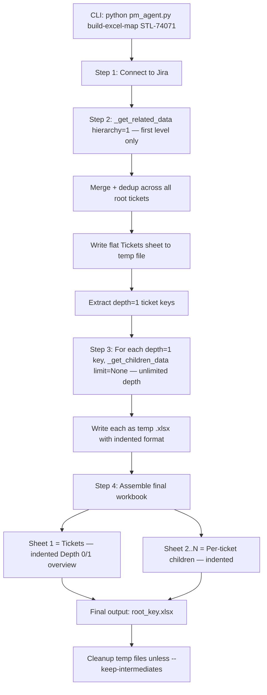

# `build-excel-map` Architecture

## Overview

A subcommand in `pm_agent.py` that orchestrates a multi-step Jira data gathering and Excel assembly pipeline. It produces a single `.xlsx` workbook with:

- **Sheet 1 ("Tickets")**: An indented overview of root ticket(s) and their first-level children only (`hierarchy=1`). Uses Depth 0 / Depth 1 columns to show the parent-child relationship.
- **Sheets 2..N (per ticket key)**: Each first-level child gets its own sheet with unlimited child hierarchy (indented format with depth columns).

Designed as a deterministic pipeline in `pm_agent.py` (subcommand `build-excel-map`) that imports from `jira_utils.py` for Jira data gathering and `_write_excel()` for Excel output. Also wrapped as an agent tool in `tools/excel_tools.py`.

## Workflow Diagram



## Detailed Step Breakdown

### Step 1: Connect to Jira

- Establishes Jira connection via `jira_utils.connect_to_jira()`.
- Optionally validates project key if `--project` is provided.

### Step 2: Get First-Level Related Issues

- For each root ticket, calls `_get_related_data(jira, root_key, hierarchy=1, limit=limit)`.
- **Always uses `hierarchy=1`** — the overview sheet shows only root + first-level children.
- Merges results across multiple root tickets, deduplicating by issue key.
- Writes the merged data to a temp `.xlsx` file using `dump_tickets_to_file()` with `table_format='indented'` and depth/via/relation/from_key extras — producing Depth 0 / Depth 1 columns.

### Step 3: Get Children for Each First-Level Ticket

- Extracts all ticket keys where `depth == 1` from the merged data.
- For each depth=1 key, calls `_get_children_data(jira, ticket_key, limit=None)` — **unlimited depth**.
- Each result is written to a temp `.xlsx` file via `dump_tickets_to_file()` with `table_format='indented'` (includes depth columns).

### Step 4: Assemble Final Workbook

- Creates the final output workbook using openpyxl.
- **Sheet 1 ("Tickets")**: Indented overview (Depth 0 / Depth 1 columns) copied from Step 2 temp file. Preserves formatting, hyperlinks, conditional formatting.
- **Sheets 2..N**: Each named after the ticket key (e.g., "STL-73989"). Copied from Step 3 temp files. Preserves formatting.
- Saves to `{root_key}.xlsx` (or `--output` if specified).

### Step 5: Cleanup

- Deletes all temp `.xlsx` files unless `--keep-intermediates` is specified.
- Logs the list of intermediate files if kept.

## CLI Interface

```
python pm_agent.py build-excel-map STL-74071 [STL-76297 ...] [options]

Required:
  ticket_keys              One or more root ticket keys

Optional:
  --project KEY, -p KEY    Optional project key for validation
  --hierarchy DEPTH        Hierarchy depth (default: 1) — controls overview sheet depth
  --limit N                Max tickets per step
  --output FILE, -o FILE   Output filename (default: {root_key}.xlsx)
  --keep-intermediates     Keep temp files instead of cleaning up
```

## Function Signatures

### In `jira_utils.py` (data-gathering refactors)

```python
def _get_related_data(jira, root_key, hierarchy=None, limit=None):
    '''
    Core data-gathering logic for get_related_issues.
    Returns ordered list of dicts with keys: issue, depth, via, relation, from_key.
    Does NOT print or dump to file.
    '''
    ...

def _get_children_data(jira, root_key, limit=None):
    '''
    Core data-gathering logic for get_children_hierarchy.
    Returns ordered list of dicts with keys: issue, depth.
    Does NOT print or dump to file.
    '''
    ...
```

### In `pm_agent.py` (subcommand handler + orchestration)

```python
def cmd_build_excel_map(args):
    '''
    Build a multi-sheet Excel workbook mapping one or more tickets and all
    their related issues' child hierarchies.

    Steps:
        1. Connect to Jira
        2. For each root ticket, _get_related_data(hierarchy=1) — first level only
        3. Merge into one flat "Tickets" sheet (deduplicating by key)
        4. For each depth=1 ticket, _get_children_data(limit=None) — unlimited depth
        5. Write each as a temp .xlsx via dump_tickets_to_file
        6. Assemble all into one workbook: Tickets (indented depth 0-1) + per-ticket sheets (indented unlimited)
        7. Cleanup temp files
    '''
    ...
```

### In `tools/excel_tools.py` (agent tool wrapper)

```python
@tool(description='Build a multi-sheet Excel map from one or more root tickets')
def build_excel_map(
    ticket_keys: List[str],
    limit: int = None,
    output_file: str = None,
) -> ToolResult:
    '''
    Build a multi-sheet Excel workbook mapping one or more tickets and their
    related issues' child hierarchies.  Sheet 1 is an indented overview
    (Depth 0 / Depth 1) of root + first-level children.  Sheets 2..N are per-ticket children with unlimited
    depth (indented format).
    '''
    ...
```

## Data Flow

```
Root ticket(s) (STL-74071, STL-76297)
    │
    ├── _get_related_data(hierarchy=1) for each root
    │   └── merged = [
    │         {issue: STL-74071, depth: 0},
    │         {issue: STL-73989, depth: 1, via: 'child'},
    │         {issue: STL-74843, depth: 1, via: 'child'},
    │         {issue: STL-76297, depth: 0},
    │         {issue: STL-76300, depth: 1, via: 'child'},
    │         ...
    │       ]
    │
    ├── dump_tickets_to_file(merged, extras, table_format='indented')
    │   └── Sheet "Tickets": Depth 0 | Depth 1 | project | issue_type | status | ...
    │
    ├── For each depth=1 key:
    │   ├── _get_children_data(STL-73989, limit=None) → temp_STL-73989.xlsx (indented)
    │   ├── _get_children_data(STL-74843, limit=None) → temp_STL-74843.xlsx (indented)
    │   ├── _get_children_data(STL-76300, limit=None) → temp_STL-76300.xlsx (indented)
    │   └── ... (one per depth=1 ticket)
    │
    └── Assemble final workbook:
        ├── Sheet 1: "Tickets" (indented overview — Depth 0 / Depth 1 columns)
        ├── Sheet 2: "STL-73989" (indented children, unlimited depth)
        ├── Sheet 3: "STL-74843" (indented children, unlimited depth)
        ├── Sheet 4: "STL-76300" (indented children, unlimited depth)
        └── ... (one sheet per depth=1 ticket)
```

## Refactoring Strategy

The key refactoring was splitting `get_related_issues()` and `get_children_hierarchy()` into:

1. **Data-gathering functions** (`_get_related_data()`, `_get_children_data()`) — return in-memory data structures
2. **Display/dump wrappers** (existing functions) — call the data functions, then handle printing and file output

This follows the existing pattern where `_write_excel()` is already a separate helper. The refactoring is additive — existing CLI behavior is unchanged.

## Files Changed

| File | Change |
|------|--------|
| `jira_utils.py` | Extract `_get_related_data()` from `get_related_issues()` |
| `jira_utils.py` | Extract `_get_children_data()` from `get_children_hierarchy()` |
| `pm_agent.py` | Add `cmd_build_excel_map()` handler function |
| `pm_agent.py` | Add `build-excel-map` subparser to `handle_args()` |
| `tools/excel_tools.py` | Agent tool wrapper for `build_excel_map` and `excel_utils` functions |
| `tools/__init__.py` | Add excel tool exports |

## Progress Logging

```
============================================================
BUILD EXCEL MAP
============================================================
Root ticket(s):  STL-74071, STL-76297
Hierarchy depth: 1
Output file:     STL-74071_STL-76297.xlsx

Step 1/4: Connecting to Jira...
Step 2/4: Getting first-level issues for 2 root ticket(s)...
  Fetching related for STL-74071...
    17 issues (1 root + 16 depth=1), 17 new after dedup
  Fetching related for STL-76297...
    8 issues (1 root + 7 depth=1), 8 new after dedup
  Merged total: 25 unique issues

Step 3/4: Getting children for 23 depth=1 tickets...
  [1/23] STL-73989: 45 children
  [2/23] STL-74843: 12 children
  [3/23] STL-73986: 23 children
  ...

Step 4/4: Assembling final workbook...
  Sheet 1: Tickets (25 rows)
  Sheet 2: STL-73989 (45 rows)
  Sheet 3: STL-74843 (12 rows)
  ...

Output: STL-74071_STL-76297.xlsx (24 sheets, 342 total rows)
```
