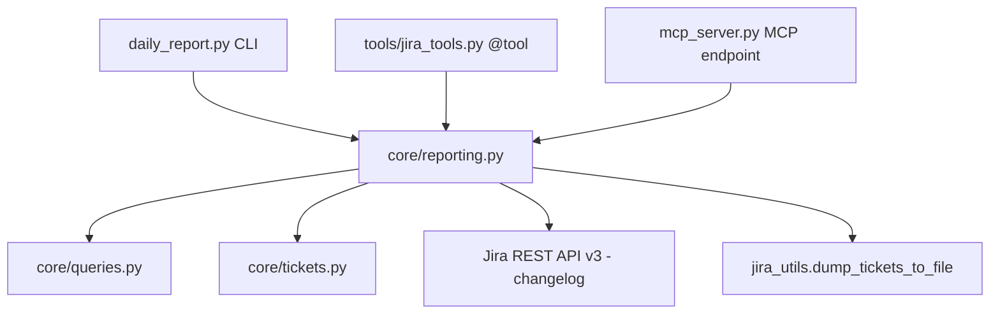

# Daily Report Tool Integration Design

## Overview

Integrate the daily report functionality into the agentic workflow as reusable tools,
with optional CSV/Excel export. The current `daily_report.py` becomes a thin CLI
wrapper over a new `core/reporting.py` module.

## Architecture



## Layer Design

### 1. `core/reporting.py` — Pure Logic Layer

No print statements, no CLI concerns. Returns structured dicts that any consumer
can format however they want.

```python
# --- Individual query functions ---

def tickets_created_on(jira, project: str, target_date: str) -> list[dict]:
    """Return issue dicts for all tickets created on target_date."""

def bugs_missing_field(jira, project: str, field: str = 'affectedVersion',
                       target_date: str | None = None) -> dict:
    """Return {flagged: list[dict], total_open_count: int}.
    
    field can be: affectedVersion, fixVersion, components, etc.
    If target_date is given, flagged = bugs created that day missing the field.
    total_open_count = all open bugs missing the field (regardless of date).
    """

def status_changes_by_actor(project: str, target_date: str,
                            automation_keywords: list[str] | None = None) -> dict:
    """Return {automation: list[dict], human: list[dict], total: int}.
    
    Each transition dict: {key, from, to, author, email, time}.
    Uses REST API v3 /rest/api/3/search/jql with changelog expand.
    """

# --- Composite report function ---

def daily_report(jira, project: str, target_date: str | None = None) -> dict:
    """Run all three queries and return a combined report dict.
    
    Returns:
        {
            date: str,
            project: str,
            created_tickets: list[dict],
            bugs_missing_affects_version: {flagged: [...], total_open_count: int},
            status_changes: {automation: [...], human: [...], total: int},
        }
    """

# --- Export helper ---

def export_daily_report(report: dict, output_path: str, fmt: str = 'excel') -> str:
    """Write the daily report to CSV or Excel.
    
    Creates a multi-sheet Excel workbook:
      - Sheet 1: Created Tickets
      - Sheet 2: Bugs Missing Affects Version  
      - Sheet 3: Status Changes (all, with automation flag column)
    
    For CSV, creates 3 files: {base}_created.csv, {base}_bugs.csv, {base}_changes.csv
    
    Returns the output path.
    """
```

### 2. `tools/jira_tools.py` — Agent Tool Layer

Four `@tool`-decorated functions that wrap `core/reporting`:

```python
@tool(name='get_tickets_created_on', 
      description='Find all tickets created on a specific date')
def get_tickets_created_on(project_key: str, date: str = '') -> ToolResult:
    """date defaults to today if empty."""

@tool(name='find_bugs_missing_field',
      description='Find bugs missing a required field like Affects Version')
def find_bugs_missing_field(project_key: str, field: str = 'affectedVersion',
                            date: str = '') -> ToolResult:
    """field: affectedVersion, fixVersion, components, etc."""

@tool(name='get_status_changes',
      description='Get status transitions for a date, separated by automation vs human')
def get_status_changes(project_key: str, date: str = '') -> ToolResult:

@tool(name='daily_report',
      description='Run a full daily report: created tickets, missing fields, automation changes')
def daily_report_tool(project_key: str, date: str = '',
                      dump_file: str = '', dump_format: str = 'excel') -> ToolResult:
    """Composite tool. If dump_file is provided, exports to file."""
```

### 3. `mcp_server.py` — MCP Endpoints

Four matching MCP tool endpoints that delegate to `core/reporting`:

```python
@_tool_decorator()
async def get_tickets_created_on(project_key: str, date: str = '') -> list:
    ...

@_tool_decorator()
async def find_bugs_missing_field(project_key: str, field: str = 'affectedVersion',
                                   date: str = '') -> list:
    ...

@_tool_decorator()
async def get_status_changes(project_key: str, date: str = '') -> list:
    ...

@_tool_decorator()
async def daily_report(project_key: str, date: str = '',
                       dump_file: str = '') -> list:
    ...
```

### 4. `JiraTools` Class Delegates

Add four delegate methods to the `JiraTools(BaseTool)` class:

```python
@tool(description='Find all tickets created on a specific date')
def get_tickets_created_on(self, project_key: str, date: str = '') -> ToolResult:
    return get_tickets_created_on(project_key, date)

@tool(description='Find bugs missing a required field')
def find_bugs_missing_field(self, project_key: str, 
                            field: str = 'affectedVersion', date: str = '') -> ToolResult:
    return find_bugs_missing_field(project_key, field, date)

@tool(description='Get status transitions separated by automation vs human')
def get_status_changes(self, project_key: str, date: str = '') -> ToolResult:
    return get_status_changes(project_key, date)

@tool(description='Run full daily report with optional export')
def daily_report(self, project_key: str, date: str = '',
                 dump_file: str = '', dump_format: str = 'excel') -> ToolResult:
    return daily_report_tool(project_key, date, dump_file, dump_format)
```

### 5. `daily_report.py` — Thin CLI Wrapper

Refactored to import from `core/reporting` and just handle:
- Argument parsing
- Pretty-printing to stdout
- Calling `export_daily_report()` when `--output` is provided

```
.venv/bin/python3 daily_report.py                              # stdout only
.venv/bin/python3 daily_report.py --output report.xlsx         # Excel export
.venv/bin/python3 daily_report.py --output report --format csv # CSV export
```

## Export Format

### Excel (multi-sheet workbook)

| Sheet | Columns |
|-------|---------|
| Created Tickets | key, issue_type, status, priority, assignee, summary, created |
| Bugs Missing Field | key, status, priority, assignee, summary, created, missing_field |
| Status Changes | key, from_status, to_status, author, email, time, is_automation |

Uses existing `_write_excel()` from `jira_utils.py` for consistent formatting
(header styling, conditional formatting, auto-fit columns, frozen header row).

### CSV (3 separate files)

Same columns as Excel sheets, written as `{base}_created.csv`, `{base}_bugs.csv`,
`{base}_changes.csv`.

## Key Design Decisions

1. **`field` parameter on `bugs_missing_field`** — Generalized beyond just Affects Version.
   Supports any JQL-queryable field: `affectedVersion`, `fixVersion`, `component`, `assignee`, etc.

2. **Automation detection via keyword list** — Default keywords: `scm-bot`, `automation`, `bot@`, `scm@`.
   Configurable per-call so teams with different bot accounts can customize.

3. **REST API v3 for changelog** — The `status_changes_by_actor` function uses the REST API
   directly (not jira-python) because `enhanced_search_issues` doesn't support `expand=changelog`.
   Uses `/rest/api/3/search/jql` with `nextPageToken` pagination.

4. **Date arithmetic** — All date ranges use explicit `YYYY-MM-DD` bounds (computed via
   `timedelta(days=1)`) to avoid the JQL `+` character which breaks Jira Cloud URL encoding.

5. **No new dependencies** — Uses existing `requests`, `openpyxl`, `jira` libraries.

## Files Modified

| File | Change |
|------|--------|
| `core/reporting.py` | **NEW** — Pure logic: 4 functions + export helper |
| `core/__init__.py` | Add `reporting` to exports |
| `tools/jira_tools.py` | Add 4 `@tool` functions + 4 `JiraTools` delegates |
| `mcp_server.py` | Add 4 MCP tool endpoints |
| `daily_report.py` | Refactor to thin CLI over `core/reporting` |
| `tests/test_core_reporting.py` | **NEW** — Unit tests for reporting functions |
