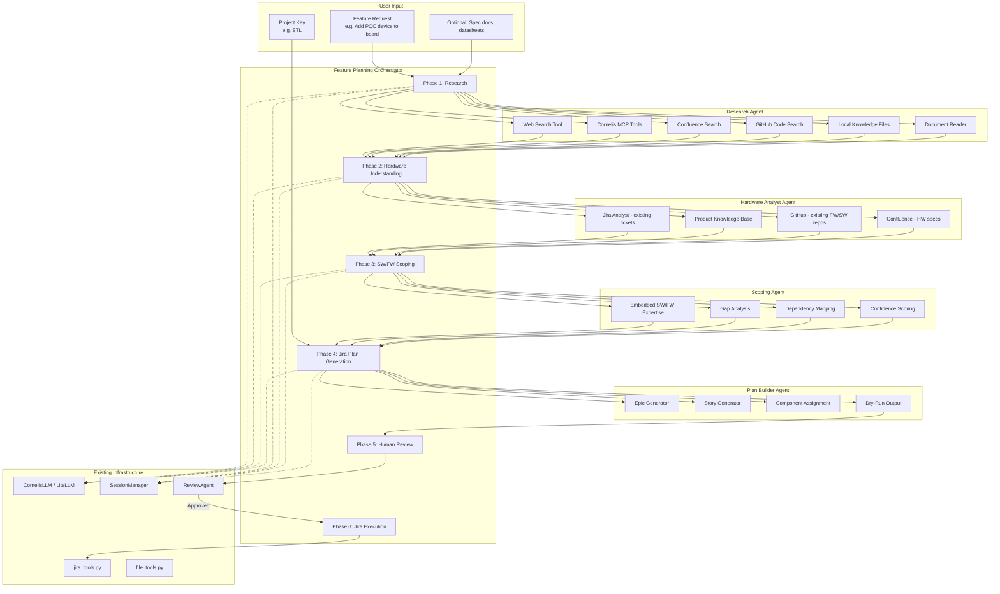
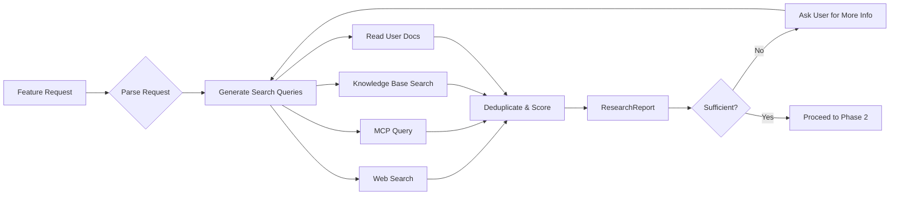
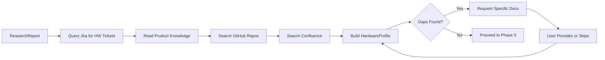
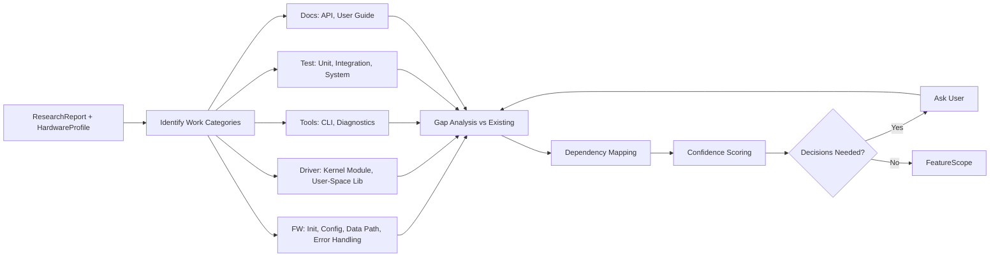

# Feature Planning Agent — Architecture Plan

## 1. Problem Statement

Cornelis Networks needs an agent that can take a high-level feature request (e.g., *"We're adding a PQC device to our board — scope the SW/FW work and build a Jira plan"*) and:

1. **Research** the feature domain using web search, internal docs, Cornelis MCP tools, Jira, Confluence, and GitHub
2. **Understand** the existing Cornelis hardware product deeply — what it is, how it works, what SW/FW already exists
3. **Define & Scope** the SW/FW development work required to support the new feature on the hardware
4. **Build a Jira Project Plan** with Epics and Stories in an existing Jira project (dry-run first, execute after approval)

### Design Principles

- **Confidence-aware**: Every research finding and scoping decision carries a confidence level (high/medium/low)
- **Honest**: Never fabricate information — clearly state what is known vs. unknown
- **Interactive**: Ask the user for decisions when multiple valid paths exist; request specific documents/info when gaps are found
- **Incremental**: Do what you can with what you have, then identify what's missing
- **Safe**: All Jira writes are dry-run by default; explicit approval required before execution

---

## 2. Architecture Overview



---

## 3. Agent Design

### 3.1 Feature Planning Orchestrator

**New file**: `agents/feature_planning_orchestrator.py`

The top-level orchestrator that coordinates the 6-phase workflow. Extends `BaseAgent`.

```
class FeaturePlanningOrchestrator(BaseAgent):
    Phases:
      1. research        -> ResearchAgent
      2. hw_analysis     -> HardwareAnalystAgent
      3. scoping         -> ScopingAgent
      4. plan_generation -> FeaturePlanBuilderAgent
      5. review          -> ReviewAgent (existing)
      6. execution       -> jira_tools.py (existing)

    State: FeaturePlanningState (dataclass)
      - feature_request: str
      - project_key: str
      - research_findings: List[ResearchFinding]
      - hw_understanding: HardwareProfile
      - scope: FeatureScope
      - jira_plan: JiraPlan
      - questions_for_user: List[Question]
      - confidence_report: ConfidenceReport
```

### 3.2 Research Agent

**New file**: `agents/research_agent.py`

Gathers information from all available sources about the feature domain.

**Responsibilities:**
- Web search for public specs, standards, datasheets (e.g., PQC algorithms, NIST standards)
- Query Cornelis MCP for internal knowledge
- Search Confluence for internal docs
- Search GitHub for existing code/implementations
- Read local knowledge files (`data/knowledge/`)
- Read user-provided documents (PDFs, specs)

**Key behavior:**
- Each finding tagged with: source, confidence level, relevance score
- Produces a structured `ResearchReport` with sections: domain overview, standards/specs, existing implementations, open questions

**Tools used:**
- `web_search` (new tool — wraps MCP or direct API)
- `mcp_query` (new tool — generic Cornelis MCP tool caller)
- `confluence_search` (new tool — if available via MCP, otherwise deferred)
- `github_search` (new tool — if available via MCP, otherwise deferred)
- `read_file` (existing)
- `read_json` (existing)

### 3.3 Hardware Analyst Agent

**New file**: `agents/hardware_analyst.py`

Builds a deep understanding of the target Cornelis hardware product.

**Responsibilities:**
- Query Jira for existing HW/SW/FW tickets related to the product
- Read product knowledge base (`data/knowledge/cornelis_products.md` and any product-specific files)
- Search GitHub repos for existing firmware/driver code structure
- Search Confluence for hardware specs and block diagrams
- Build a `HardwareProfile`: components, interfaces, existing SW/FW stack, bus protocols, memory maps

**Key behavior:**
- Maps the hardware architecture: what buses exist, what peripherals, what firmware already runs
- Identifies existing SW/FW components that the new feature must integrate with
- Flags areas where information is missing with specific requests for docs

**Tools used:**
- `get_project_info`, `search_tickets`, `get_related_tickets` (existing jira_tools)
- `read_file` (existing)
- `mcp_query` (new)
- `confluence_search` (new, if available)
- `github_search` (new, if available)

### 3.4 Scoping Agent

**New file**: `agents/scoping_agent.py`

The embedded SW/FW engineering expert. Takes research findings + hardware understanding and defines the work.

**Responsibilities:**
- Identify all SW/FW work items needed (drivers, firmware modules, APIs, tools, tests)
- Perform gap analysis: what exists vs. what's needed
- Map dependencies between work items
- Assign confidence levels to each scope item
- Identify decisions that need human input
- Estimate relative complexity (S/M/L/XL) — NOT time estimates

**Key behavior:**
- Thinks like an embedded systems architect
- Considers: initialization, configuration, data path, error handling, diagnostics, testing
- For each work item: what it is, why it's needed, what it depends on, confidence level
- Produces a `FeatureScope` with categorized work items

**Output structure:**
```
FeatureScope:
  - firmware_items: List[ScopeItem]     # FW modules, init sequences, register access
  - driver_items: List[ScopeItem]       # Kernel drivers, user-space libs
  - tool_items: List[ScopeItem]         # CLI tools, diagnostics
  - test_items: List[ScopeItem]         # Test plans, automation
  - integration_items: List[ScopeItem]  # Integration with existing stack
  - documentation_items: List[ScopeItem]
  - open_questions: List[Question]
  - assumptions: List[Assumption]
```

### 3.5 Feature Plan Builder Agent

**New file**: `agents/feature_plan_builder.py`

Converts the scoped work into a concrete Jira plan.

**Responsibilities:**
- Group scope items into Epics (by functional area: FW, Driver, Tools, Test, Docs)
- Create Stories under each Epic (one per scope item or logical grouping)
- Assign components based on Jira project's existing component list
- Assign owners based on org chart / component leads (if available)
- Generate dry-run output: structured JSON + human-readable Markdown

**Key behavior:**
- Uses existing `PlannedTicket` and `PlannedRelease` dataclasses from `planning_agent.py`
- Respects 2-level hierarchy: Epic → Story (no Tasks)
- Each Story description includes: what, why, acceptance criteria, dependencies, confidence level
- Produces both JSON (for Jira execution) and Markdown (for human review)

**Tools used:**
- `get_components`, `get_project_info` (existing jira_tools)
- `write_file`, `write_json` (existing file_tools)

---

## 4. New Tools

### 4.1 MCP Client Tool

**New file**: `tools/mcp_tools.py`

Generic MCP client that can discover and call tools on the Cornelis MCP server.

```python
@tool(name='mcp_discover_tools', description='List available tools on the Cornelis MCP server')
def mcp_discover_tools() -> ToolResult:
    ...

@tool(name='mcp_call_tool', description='Call a specific tool on the Cornelis MCP server')
def mcp_call_tool(tool_name: str, arguments: Dict) -> ToolResult:
    ...
```

**Configuration** (added to `config/settings.py`):
```python
mcp_url: str          # http://cn-ai-01.cornelisnetworks.com:50700/mcp
mcp_api_key_env: str  # CORNELIS_AI_API_KEY
mcp_timeout: int      # 60
```

### 4.2 Web Search Tool

**New file**: `tools/web_search_tools.py`

If the MCP server exposes a web search tool, this wraps it. Otherwise, provides a fallback using a direct search API.

```python
@tool(name='web_search', description='Search the web for information')
def web_search(query: str, max_results: int = 10) -> ToolResult:
    # Try MCP web_search first, fall back to direct API
    ...
```

### 4.3 Knowledge Tools

**New file**: `tools/knowledge_tools.py`

Tools for searching and reading the local knowledge base and user-provided documents.

```python
@tool(name='search_knowledge', description='Search the local knowledge base')
def search_knowledge(query: str) -> ToolResult:
    # Search data/knowledge/*.md files for relevant content
    ...

@tool(name='read_document', description='Read and extract text from a document')
def read_document(file_path: str) -> ToolResult:
    # Supports: PDF, DOCX, MD, TXT
    ...
```

---

## 5. New Prompts

### 5.1 `config/prompts/feature_planning_orchestrator.md`

System prompt for the orchestrator — defines the 6-phase workflow, confidence model, and interaction patterns.

### 5.2 `config/prompts/research_agent.md`

System prompt emphasizing: thorough multi-source research, source attribution, confidence tagging, identifying gaps.

### 5.3 `config/prompts/hardware_analyst.md`

System prompt with embedded systems expertise: bus protocols, peripheral interfaces, firmware architecture patterns, driver models.

### 5.4 `config/prompts/scoping_agent.md`

System prompt for the embedded SW/FW scoping expert: work breakdown structure, dependency analysis, gap analysis, complexity estimation.

### 5.5 `config/prompts/feature_plan_builder.md`

System prompt for Jira plan generation: Epic/Story best practices, component mapping, description templates with acceptance criteria.

---

## 6. New Data Models

**New file**: `agents/feature_planning_models.py`

```python
@dataclass
class ResearchFinding:
    content: str
    source: str           # web, confluence, github, mcp, knowledge_base, user_doc
    source_url: str       # URL or file path
    confidence: str       # high, medium, low
    relevance: str        # direct, supporting, background
    category: str         # standard, spec, implementation, tutorial, internal

@dataclass
class ResearchReport:
    domain_overview: str
    standards_and_specs: List[ResearchFinding]
    existing_implementations: List[ResearchFinding]
    internal_knowledge: List[ResearchFinding]
    open_questions: List[str]
    confidence_summary: Dict[str, int]  # {high: N, medium: N, low: N}

@dataclass
class HardwareProfile:
    product_name: str
    description: str
    components: List[Dict]          # {name, type, interface, description}
    bus_interfaces: List[Dict]      # {name, protocol, speed, description}
    existing_firmware: List[Dict]   # {name, description, repo_url}
    existing_drivers: List[Dict]    # {name, description, repo_url}
    existing_tools: List[Dict]      # {name, description}
    block_diagram: Optional[str]    # Mermaid or text description
    gaps: List[str]                 # Missing information

@dataclass
class ScopeItem:
    title: str
    description: str
    category: str          # firmware, driver, tool, test, integration, documentation
    complexity: str        # S, M, L, XL
    confidence: str        # high, medium, low
    dependencies: List[str]
    rationale: str         # Why this work is needed
    acceptance_criteria: List[str]

@dataclass
class Question:
    question: str
    context: str           # Why we need to know
    options: List[str]     # Suggested answers if applicable
    blocking: bool         # Does this block further progress?

@dataclass
class FeatureScope:
    feature_name: str
    summary: str
    firmware_items: List[ScopeItem]
    driver_items: List[ScopeItem]
    tool_items: List[ScopeItem]
    test_items: List[ScopeItem]
    integration_items: List[ScopeItem]
    documentation_items: List[ScopeItem]
    open_questions: List[Question]
    assumptions: List[str]
    confidence_report: Dict[str, Any]

@dataclass
class JiraPlan:
    project_key: str
    epics: List[PlannedTicket]      # Reuse from planning_agent.py
    stories: List[PlannedTicket]    # Reuse from planning_agent.py
    summary_markdown: str           # Human-readable plan
    confidence_report: Dict[str, Any]
```

---

## 7. Workflow Detail

### Phase 1: Research



### Phase 2: Hardware Understanding



### Phase 3: SW/FW Scoping



### Phase 4: Jira Plan Generation


### Phase 5: Human Review

Uses existing `ReviewAgent` — presents the plan, allows modifications, gets approval.

### Phase 6: Jira Execution

Uses existing `jira_tools.py` `create_ticket()` — creates Epics first, then Stories with parent links.

---

## 8. CLI Integration

Add a new workflow to `pm_agent.py`:

```
pm-agent --workflow feature-plan \
    --project STL \
    --feature "Add PQC device support to CN5000 board" \
    [--docs path/to/spec.pdf path/to/datasheet.pdf] \
    [--output feature_plan.json] \
    [--execute]
```

**Flags:**
- `--project`: Target Jira project key (required)
- `--feature`: Feature description in natural language (required)
- `--docs`: Optional paths to spec documents, datasheets, etc.
- `--output`: Output file for the dry-run plan (default: `feature_plan.json`)
- `--execute`: Actually create tickets in Jira (default: dry-run only)

---

## 9. Configuration Changes

### `config/settings.py` additions

```python
# MCP Configuration
mcp_url: str = ''
mcp_api_key_env: str = 'CORNELIS_AI_API_KEY'
mcp_timeout: int = 60
mcp_enabled: bool = True

# Feature Planning Configuration
feature_planning_max_research_queries: int = 20
feature_planning_confidence_threshold: str = 'medium'  # minimum confidence to include in plan
```

### `.env.example` additions

```bash
# Cornelis MCP Server
CORNELIS_MCP_URL=http://cn-ai-01.cornelisnetworks.com:50700/mcp
CORNELIS_AI_API_KEY=user.name@cornelisnetworks.com
```

### `data/knowledge/` additions

```
data/knowledge/cornelis_products.md          # (existing - enhance with more detail)
data/knowledge/embedded_sw_fw_patterns.md    # NEW: Common patterns for FW/driver development
data/knowledge/jira_conventions.md           # NEW: Cornelis Jira naming/labeling conventions
```

---

## 10. File Summary

### New Files

| File | Description |
|------|-------------|
| `agents/feature_planning_orchestrator.py` | Top-level orchestrator for the 6-phase workflow |
| `agents/research_agent.py` | Multi-source research agent |
| `agents/hardware_analyst.py` | Hardware product understanding agent |
| `agents/scoping_agent.py` | Embedded SW/FW scoping expert agent |
| `agents/feature_plan_builder.py` | Jira plan generation agent |
| `agents/feature_planning_models.py` | Data models for the feature planning pipeline |
| `tools/mcp_tools.py` | Cornelis MCP client tools |
| `tools/web_search_tools.py` | Web search tool (MCP-backed or direct) |
| `tools/knowledge_tools.py` | Local knowledge base search tools |
| `config/prompts/feature_planning_orchestrator.md` | Orchestrator system prompt |
| `config/prompts/research_agent.md` | Research agent system prompt |
| `config/prompts/hardware_analyst.md` | Hardware analyst system prompt |
| `config/prompts/scoping_agent.md` | Scoping agent system prompt |
| `config/prompts/feature_plan_builder.md` | Plan builder system prompt |
| `data/knowledge/embedded_sw_fw_patterns.md` | Embedded development patterns knowledge |
| `data/knowledge/jira_conventions.md` | Jira conventions knowledge |

### Modified Files

| File | Changes |
|------|---------|
| `pm_agent.py` | Add `--workflow feature-plan` subcommand |
| `config/settings.py` | Add MCP and feature planning config fields |
| `.env.example` | Add MCP environment variables |
| `data/knowledge/cornelis_products.md` | Enhance with more hardware detail |
| `README.md` | Document the new workflow |

---

## 11. Implementation Order

1. **Foundation**: Data models, MCP tools, knowledge tools, web search tools
2. **Research Agent**: Agent + prompt + integration with tools
3. **Hardware Analyst Agent**: Agent + prompt + Jira/knowledge integration
4. **Scoping Agent**: Agent + prompt + embedded expertise prompt engineering
5. **Feature Plan Builder Agent**: Agent + prompt + dry-run output
6. **Orchestrator**: Wire all agents together, state management, session persistence
7. **CLI Integration**: Add `--workflow feature-plan` to `pm_agent.py`
8. **Review & Execute**: Integrate with existing ReviewAgent and jira_tools
9. **Knowledge Base**: Create embedded_sw_fw_patterns.md and jira_conventions.md
10. **Testing & Refinement**: End-to-end test with PQC example, tune prompts

---

## 12. Open Questions

1. **MCP Tool Surface**: What tools does the Cornelis MCP server expose? (Pending curl discovery)
2. **Confluence Access**: Is Confluence accessible via MCP, or do we need a separate Confluence API client?
3. **GitHub Access**: Is GitHub accessible via MCP, or do we need a separate GitHub API client?
4. **Org Chart**: Is there a draw.io org chart file available for owner assignment, or should we skip auto-assignment?
5. **Knowledge Base Depth**: How much detail should `cornelis_products.md` contain about hardware architecture? Should we create per-product knowledge files?
