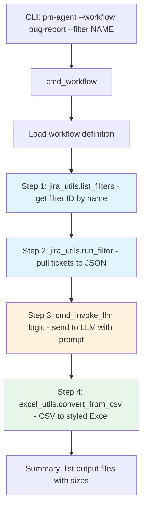

# Native `--workflow` Command vs Bash Scripts for Multi-Step Pipelines

**Date:** 2026-02-14
**Status:** Analysis / Decision Record
**Author:** Architecture Review

---

## 1. Problem Statement

The project has a working bash script ([`run_bug_report.sh`](run_bug_report.sh)) that orchestrates a 4-step pipeline:

1. Look up a Jira filter by name from favourite filters → filter ID
2. Run the filter to pull tickets with latest comments → JSON file
3. Send JSON to LLM agent with a prompt → CSV output
4. Convert CSV to styled Excel workbook

The question is whether to:

- **Option A** — Add a native `--workflow bug-report` command to [`pm_agent.py`](pm_agent.py) that runs the same 4 steps in Python
- **Option B** — Keep bash scripts as the orchestration layer, chaining CLI calls to [`jira_utils.py`](jira_utils.py), [`pm_agent.py`](pm_agent.py), and [`excel_utils.py`](excel_utils.py)

---

## 2. Current Architecture

### 2.1 Tool Landscape

| Tool | Entry Point | Lines | Role |
|------|-------------|-------|------|
| [`jira_utils.py`](jira_utils.py) | `jira-utils` | ~6166 | Standalone Jira CLI with [`handle_args()`](jira_utils.py) / [`main()`](jira_utils.py) |
| [`pm_agent.py`](pm_agent.py) | `pm-agent` | ~1261 | Agent pipeline CLI: `--plan`, `--analyze`, `--invoke-llm`, `--build-excel-map`, etc. |
| [`excel_utils.py`](excel_utils.py) | `excel-utils` | ~1291 | Standalone Excel CLI: `--concat`, `--convert-from-csv`, `--diff` |
| [`agents/orchestrator.py`](agents/orchestrator.py) | (library) | ~426 | Release planning orchestrator using sub-agents |

All three CLIs are installable via `pipx` as separate console entry points defined in [`pyproject.toml`](pyproject.toml:38).

### 2.2 Existing Cross-Module Patterns

The codebase already has a precedent for native Python orchestration:

- [`cmd_build_excel_map()`](pm_agent.py:280) in `pm_agent.py` directly imports and calls [`jira_utils`](jira_utils.py) functions ([`connect_to_jira()`](jira_utils.py:408), [`_get_related_data()`](jira_utils.py:1598), [`_get_children_data()`](jira_utils.py:1389), [`dump_tickets_to_file()`](jira_utils.py:3125)) — no subprocess calls.
- [`cmd_invoke_llm()`](pm_agent.py:682) handles prompt loading, attachment classification, vision API, token tracking, and file extraction — all inline.
- The [`ReleasePlanningOrchestrator`](agents/orchestrator.py:106) coordinates multiple sub-agents through a [`WorkflowState`](agents/orchestrator.py:67) dataclass.

### 2.3 What the Bash Script Does

[`run_bug_report.sh`](run_bug_report.sh) (229 lines) chains four `python3` subprocess calls:

```
Step 1: python3 jira_utils.py --list-filters --favourite  → parse stdout for filter ID
Step 2: python3 jira_utils.py --run-filter $ID --dump-file $NAME --get-comments latest
Step 3: python3 pm_agent.py --invoke-llm $PROMPT --attachments $JSON --timeout 800
Step 4: python3 excel_utils.py --convert-from-csv cn_bug_report.csv
```

The script includes ~100 lines of boilerplate: pre-flight checks, stdout parsing with `awk`/`cut`/`sed` to extract the filter ID from formatted table output, temp file management, and error handling.

---

## 3. Comparative Analysis

### 3.1 Complexity & Maintenance

| Criterion | Option A: Native `--workflow` | Option B: Bash Scripts |
|-----------|-------------------------------|------------------------|
| Lines of code for bug-report | ~80-120 Python | ~229 bash (existing) |
| Stdout parsing needed | No — direct function return values | Yes — fragile `awk`/`cut` parsing of formatted output |
| Data passing between steps | In-memory Python objects | Temp files + stdout scraping |
| Adding a new workflow | Add a `cmd_workflow_*()` function or YAML definition | Write a new `.sh` script from scratch |
| Dependency on output format | None — uses API return values | Breaks if column widths or output format changes |

**Verdict: Option A wins.** The bash script's most fragile section is the 45-line filter-ID extraction block (lines 104-145 of [`run_bug_report.sh`](run_bug_report.sh:104)) that parses fixed-width column output. Any change to the [`list_filters()`](jira_utils.py:4004) output format silently breaks the pipeline. A native workflow would call [`list_filters()`](jira_utils.py:4004) and get structured data back directly.

### 3.2 Error Handling & Reliability

| Criterion | Option A: Native `--workflow` | Option B: Bash Scripts |
|-----------|-------------------------------|------------------------|
| Error propagation | Python exceptions with full stack traces | Exit codes only; `set -euo pipefail` stops on first failure |
| Partial failure recovery | Can catch per-step exceptions, retry, or skip | Script aborts; must re-run from scratch |
| Logging | Unified [`cornelis_agent.log`](pm_agent.py:42) with function/line context | Separate log per tool + bash `log()` helper |
| Debugging | Single Python debugger session; `--debug` flag | Must debug each subprocess independently |
| Intermediate state | Can persist [`WorkflowState`](agents/orchestrator.py:67) between steps | Files on disk only |

**Verdict: Option A wins.** The native approach gives structured error handling, unified logging, and the ability to retry individual steps. The bash script's `set -euo pipefail` is all-or-nothing — if Step 3 (LLM call, ~800s timeout) fails, you re-run the entire pipeline including the Jira API calls.

### 3.3 Reusability

| Criterion | Option A: Native `--workflow` | Option B: Bash Scripts |
|-----------|-------------------------------|------------------------|
| Creating new workflows | Compose existing Python functions; optionally define in YAML | Copy-paste bash script, modify commands |
| Sharing steps between workflows | Import functions directly | No sharing; each script is standalone |
| Parameterization | Python argparse with type checking, defaults, validation | Bash positional args with manual validation |
| Workflow discovery | `pm-agent --workflow --list` shows all available workflows | `ls *.sh` |

**Verdict: Option A wins.** The existing [`cmd_build_excel_map()`](pm_agent.py:280) already demonstrates the pattern: import [`jira_utils`](jira_utils.py) functions, call them in sequence, handle errors. New workflows would follow the same pattern. With bash, each new pipeline requires re-implementing boilerplate, stdout parsing, and error handling.

### 3.4 User Experience

| Criterion | Option A: Native `--workflow` | Option B: Bash Scripts |
|-----------|-------------------------------|------------------------|
| Invocation | `pm-agent --workflow bug-report --filter "SW 12.1.1 P0/P1 Bugs"` | `./run_bug_report.sh "SW 12.1.1 P0/P1 Bugs"` |
| Help text | `pm-agent --workflow --help` with argparse descriptions | `./run_bug_report.sh` (manual usage block) |
| Progress reporting | Structured step-by-step output with consistent formatting | `log()` helper with timestamps |
| Installation | Comes with `pipx install .` — no extra setup | Must be in PATH or invoked with `./`; needs `chmod +x` |
| Shell compatibility | Works on any OS with Python | Bash-only (macOS/Linux); won't work on Windows |

**Verdict: Option A wins slightly.** Both are acceptable for the target audience (engineers comfortable with bash and Python). The native approach has a small edge in discoverability (`--help`) and installation (comes with `pipx`).

### 3.5 Testing

| Criterion | Option A: Native `--workflow` | Option B: Bash Scripts |
|-----------|-------------------------------|------------------------|
| Unit testing | Mock [`jira_utils`](jira_utils.py) functions, test each step independently | Requires `bats` or similar; mocking is painful |
| Integration testing | `pytest` with fixtures; mock LLM responses | Shell script testing is fragile |
| CI/CD | Standard Python test runner | Needs bash test framework |
| Mocking external services | `unittest.mock.patch()` on [`connect_to_jira()`](jira_utils.py:408), [`get_llm_client()`](llm/config.py) | Must mock entire CLI output |

**Verdict: Option A wins decisively.** Python's testing ecosystem is vastly superior for this use case. Each workflow step can be unit-tested with mocked dependencies.

### 3.6 Architecture Fit

The codebase already follows the pattern of native Python orchestration:

- [`cmd_build_excel_map()`](pm_agent.py:280) — imports [`jira_utils`](jira_utils.py) functions directly, orchestrates a multi-step pipeline
- [`ReleasePlanningOrchestrator`](agents/orchestrator.py:106) — coordinates sub-agents through a state machine
- [`cmd_invoke_llm()`](pm_agent.py:682) — handles the full LLM invocation lifecycle inline
- The dispatch table in [`main()`](pm_agent.py:1219) already maps command names to handler functions

Adding `--workflow` follows the established pattern. Bash scripts are an outlier in this architecture.

**Verdict: Option A wins.** The native approach is consistent with how the codebase already works.

### 3.7 Performance

| Criterion | Option A: Native `--workflow` | Option B: Bash Scripts |
|-----------|-------------------------------|------------------------|
| Process startup | Single Python process | 4 separate Python process startups (~1-2s each for import overhead) |
| Jira connection | One [`connect_to_jira()`](jira_utils.py:408) call, reuse connection | Reconnects for each subprocess |
| Data transfer | In-memory Python objects | Serialize to disk, re-read from disk |
| LLM call | Same either way (~60-800s dominates) | Same |

**Verdict: Option A wins marginally.** The LLM call dominates total runtime (60-800s), so the ~5-10s saved on process startup and Jira reconnection is negligible in practice. However, for shorter workflows without LLM calls, the difference would be more noticeable.

### 3.8 Portability

| Criterion | Option A: Native `--workflow` | Option B: Bash Scripts |
|-----------|-------------------------------|------------------------|
| macOS | ✅ | ✅ |
| Linux | ✅ | ✅ |
| Windows | ✅ (Python is cross-platform) | ❌ (requires WSL or Git Bash) |
| Container/CI | ✅ (just Python) | ⚠️ (needs bash + coreutils) |

**Verdict: Option A wins.** While the current team is on macOS, Python portability is free. Bash scripts require bash-specific features (`set -euo pipefail`, `${BASH_SOURCE[0]}`, process substitution).

---

## 4. Scorecard Summary

| Dimension | Option A | Option B | Winner |
|-----------|----------|----------|--------|
| Complexity & maintenance | ⭐⭐⭐⭐⭐ | ⭐⭐ | A |
| Error handling & reliability | ⭐⭐⭐⭐⭐ | ⭐⭐ | A |
| Reusability | ⭐⭐⭐⭐⭐ | ⭐⭐ | A |
| User experience | ⭐⭐⭐⭐ | ⭐⭐⭐ | A |
| Testing | ⭐⭐⭐⭐⭐ | ⭐ | A |
| Architecture fit | ⭐⭐⭐⭐⭐ | ⭐⭐ | A |
| Performance | ⭐⭐⭐⭐ | ⭐⭐⭐ | A (marginal) |
| Portability | ⭐⭐⭐⭐⭐ | ⭐⭐⭐ | A |

---

## 5. Recommendation

**Option A: Native `--workflow` command in `pm_agent.py`** is the clear winner across all dimensions.

### Why Not Bash?

The bash script approach has exactly one advantage: **it already exists and works today**. But the existing [`run_bug_report.sh`](run_bug_report.sh) has significant fragility — particularly the 45-line stdout-parsing block that extracts filter IDs from formatted table output. This will break silently if [`list_filters()`](jira_utils.py:4004) output format changes. The script also cannot recover from partial failures (e.g., if the LLM call fails after 10 minutes, you must re-run the Jira API calls too).

### Why Native Python?

The codebase already demonstrates this pattern successfully with [`cmd_build_excel_map()`](pm_agent.py:280), which imports [`jira_utils`](jira_utils.py) functions directly and orchestrates a multi-step pipeline. The `--workflow` command would follow the exact same pattern, and the existing functions ([`list_filters()`](jira_utils.py:4004), [`run_filter()`](jira_utils.py:4227), [`convert_from_csv()`](excel_utils.py:690)) are already importable.

---

## 6. Proposed Design

### 6.1 CLI Interface

```
pm-agent --workflow bug-report --filter "SW 12.1.1 P0/P1 Bugs" [options]
pm-agent --workflow bug-report --filter-id 12345 [options]
pm-agent --workflow --list
```

### 6.2 Architecture



### 6.3 Workflow Definition Options

Two approaches for defining workflows, not mutually exclusive:

#### Option 1: Hardcoded Python Functions (Recommended for v1)

Each workflow is a `cmd_workflow_*()` function in [`pm_agent.py`](pm_agent.py), following the existing [`cmd_build_excel_map()`](pm_agent.py:280) pattern:

```python
def cmd_workflow_bug_report(args):
    '''Run the bug-report pipeline: filter lookup -> tickets -> LLM -> Excel.'''
    import jira_utils
    from excel_utils import convert_from_csv

    # Step 1: Find filter by name
    jira = jira_utils.connect_to_jira()
    filters = jira_utils.list_filters(jira, favourite_only=True)
    filter_id = _find_filter_by_name(filters, args.filter_name)

    # Step 2: Run filter, dump to JSON
    issues = jira_utils.run_filter(jira, filter_id, dump_file=dump_name, dump_format='json')

    # Step 3: Invoke LLM with prompt + JSON attachment
    # ... reuse cmd_invoke_llm logic or extract shared function ...

    # Step 4: Convert CSV to Excel
    convert_from_csv(csv_path)
```

#### Option 2: YAML Workflow Definitions (Future Enhancement)

```yaml
# config/workflows/bug-report.yaml
name: bug-report
description: Pull Jira filter tickets through LLM analysis to Excel report
parameters:
  filter_name:
    type: string
    required: true
    description: Exact name of a Jira favourite filter
  prompt:
    type: string
    default: agents/prompts/cn5000_bugs_clean.md
  timeout:
    type: int
    default: 800

steps:
  - name: lookup-filter
    action: jira.list_filters
    params:
      favourite_only: true
    extract:
      filter_id: "find_by_name(result, filter_name)"

  - name: run-filter
    action: jira.run_filter
    params:
      filter_id: "{{ steps.lookup-filter.filter_id }}"
      dump_format: json
      get_comments: latest

  - name: invoke-llm
    action: llm.invoke
    params:
      prompt: "{{ params.prompt }}"
      attachments: ["{{ steps.run-filter.dump_file }}"]
      timeout: "{{ params.timeout }}"

  - name: convert-to-excel
    action: excel.convert_from_csv
    params:
      input_file: cn_bug_report.csv
```

### 6.4 Required Refactoring

To support native workflows, some existing functions need minor refactoring to return structured data instead of only printing to stdout:

| Function | Current Behavior | Needed Change |
|----------|-----------------|---------------|
| [`list_filters()`](jira_utils.py:4004) | Prints formatted table, returns None | Return list of filter dicts (already fetched internally) |
| [`run_filter()`](jira_utils.py:4227) | Prints + dumps to file, returns None | Return issues list + dump path |
| [`convert_from_csv()`](excel_utils.py:690) | Writes file, returns None | Return output file path |

This follows the same refactoring pattern already applied for [`_get_related_data()`](jira_utils.py:1598) and [`_get_children_data()`](jira_utils.py:1389) as documented in [`plans/build-excel-map-architecture.md`](plans/build-excel-map-architecture.md:89).

---

## 7. Implementation Plan

### Phase 1: Core Workflow Infrastructure

1. Refactor [`list_filters()`](jira_utils.py:4004) to return structured data (list of filter dicts) in addition to printing
2. Refactor [`run_filter()`](jira_utils.py:4227) to return issues list and dump file path
3. Extract shared LLM invocation logic from [`cmd_invoke_llm()`](pm_agent.py:682) into a reusable `_invoke_llm()` function
4. Add `--workflow` argument group to [`handle_args()`](pm_agent.py) in `pm_agent.py`
5. Add `cmd_workflow()` dispatcher that routes to workflow-specific handlers
6. Implement `cmd_workflow_bug_report()` as the first native workflow

### Phase 2: Polish & Migration

7. Add `--workflow --list` to enumerate available workflows
8. Add progress reporting with step numbers and timing
9. Add `--dry-run` flag to show what would be executed without running
10. Deprecate [`run_bug_report.sh`](run_bug_report.sh) with a message pointing to the native command
11. Add unit tests for the workflow with mocked Jira/LLM dependencies

### Phase 3: YAML Workflows (Optional Future)

12. Design YAML workflow schema
13. Implement YAML workflow loader and executor
14. Convert `bug-report` to YAML as proof of concept
15. Document workflow authoring guide

---

## 8. Risk Assessment

| Risk | Mitigation |
|------|------------|
| Refactoring [`list_filters()`](jira_utils.py:4004) / [`run_filter()`](jira_utils.py:4227) breaks existing CLI behavior | Add return values without changing print behavior; existing CLI callers are unaffected |
| Scope creep into full workflow engine | Phase 1 uses simple Python functions; YAML engine is Phase 3 and optional |
| LLM invocation logic is complex to extract | [`cmd_invoke_llm()`](pm_agent.py:682) is ~250 lines but well-structured; extract the core into `_invoke_llm()` and have both `cmd_invoke_llm()` and workflows call it |
| Existing bash script users disrupted | Keep [`run_bug_report.sh`](run_bug_report.sh) working during transition; add deprecation notice |

---

## 9. What to Keep from Bash

The bash script does have some good practices worth preserving in the native implementation:

- **Pre-flight checks** — verify required files exist before starting
- **Step numbering** — clear "Step 1/4", "Step 2/4" progress indicators
- **Output summary** — list all created files with sizes at the end
- **Timeout configuration** — configurable LLM timeout per workflow
- **Safe filename derivation** — converting filter names to filesystem-safe strings

---

## 10. Conclusion

**Recommendation: Implement Option A (native `--workflow` command) using hardcoded Python functions for Phase 1.**

The codebase already demonstrates this pattern with [`cmd_build_excel_map()`](pm_agent.py:280). The required refactoring is minimal (add return values to 3 functions). The result will be more maintainable, more testable, more reliable, and consistent with the existing architecture. The YAML workflow engine can be added later if the number of workflows grows beyond 3-4.

Keep [`run_bug_report.sh`](run_bug_report.sh) as a reference during implementation, then deprecate it once the native workflow is validated.
